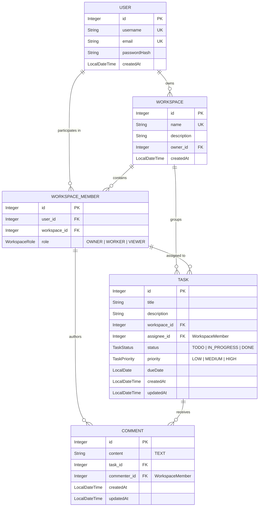

# 🚀 Task Collab — Real-Time Collaborative Task Management Backend

[](https://openjdk.org/)
[](https://spring.io/projects/spring-boot)
[](https://spring.io/projects/spring-security)
[](https://www.postgresql.org/)
[](https://spring.io/guides/gs/messaging-stomp-websocket/)
[](http://localhost:1717/swagger-ui.html)
[](https://www.docker.com/)
[](https://opensource.org/licenses/MIT)

**Task Collab** is a robust, production-grade collaborative task management REST API and real-time backend engineered with **Spring Boot** and **Java 21**. 

Designed to mirror modern workflow engines like Jira, Linear, and Trello, it empowers teams to create project workspaces, invite members with fine-grained scoped roles (`OWNER`, `WORKER`, `VIEWER`), assign tasks with priority and due-date tracking, enforce strict status transitions, and communicate via real-time WebSocket comment feeds.

---

## 📑 Table of Contents
- [Architecture & Design](#-architecture--design)
- [Database Schema & ERD](#-database-schema--erd)
- [Key Engineering Highlights](#-key-engineering-highlights)
- [Tech Stack](#-tech-stack)
- [Quick Start Guide](#-quick-start-guide)
- [🎨 SPA Frontend](#-spa-frontend)
- [Interactive Swagger UI](#-interactive-swagger-ui)
- [REST API Reference](#-rest-api-reference)
- [WebSocket Real-Time Channels](#-websocket-real-time-channels)
- [Testing Suite](#-testing-suite)
- [Project Structure](#-project-structure)

---

## 🏛 Architecture & Design

Task Collab adheres to clean, layered architecture principles with strict boundary separation:

```mermaid
graph TD
    Client["Client (Browser / Postman / Mobile)"]
    
    subgraph Spring Boot Application
        Filter["JwtService (OncePerRequestFilter)"]
        SecCtx["SecurityContext (UserPrincipal)"]
        
        subgraph REST Layer
            UserController["UserController"]
            WorkspaceController["WorkspaceController"]
            TaskController["TaskController"]
            CommentController["CommentController"]
        end
        
        subgraph Business Logic Layer
            UserService["UserService"]
            WorkspaceService["WorkspaceService"]
            TaskService["TaskService"]
            CommentService["CommentService"]
        end
        
        subgraph Real-Time Broker
            Broker["SimpMessagingTemplate (STOMP /live)"]
        end
        
        subgraph Mapping Layer
            Mappers["Static Mappers (Entity ↔ Record DTO)"]
        end
        
        subgraph Persistence Layer
            Repositories["Spring Data JPA Repositories"]
        end
    end
    
    subgraph Data Stores
        DB[("PostgreSQL 17 (Docker)")]
    end

    Client -->|HTTP + Bearer Token| Filter
    Filter -->|Set Authentication| SecCtx
    Filter --> REST Layer
    REST Layer --> Business Logic Layer
    Business Logic Layer --> Mappers
    Business Logic Layer --> Repositories
    CommentService -->|Broadcast Comment Events| Broker
    Broker -.->|Push Notifications| Client
    Repositories --> DB
```

---

## 🗄 Database Schema & ERD

Entity relationships are scoped so that tasks and comments reference **`WorkspaceMember`** rather than generic users, guaranteeing workspace-level data integrity:



---

## ✨ Key Engineering Highlights

### 1. Scoped Role-Based Access Control (RBAC)
- Rather than a flat, global role assignment (`ROLE_ADMIN` vs `ROLE_USER`), authorization is dynamically evaluated within each workspace context.
- **`OWNER`**: Workspace creator; full authority over tasks, membership, roles, and workspace deletion.
- **`WORKER`**: Can be assigned tasks, transition task statuses (`TODO` ➔ `IN_PROGRESS` ➔ `DONE`), and post comments.
- **`VIEWER`**: Read-only observer. Business logic strictly rejects assigning tasks to viewers.

### 2. Real-Time Push Notifications with WebSockets
- Integrated **STOMP over SockJS** for low-latency live collaboration.
- Whenever a comment is created, edited, or deleted, `CommentService` pushes atomic event payloads to topic subscribers without requiring polling.

### 3. Stateless Security with Custom Claims
- Generates HMAC-SHA signed JWTs containing both `username` (subject) and `id` (userId claim).
- Controllers inject the principal directly with `@AuthenticationPrincipal UserPrincipal currentUser`, eliminating repetitive user lookups on every request.

### 4. Paginated & Sorted Task Queries
- Supports paginated task retrieval (`GET /task/page/{workspaceId}?page=0&size=10&sortBy=dueDate&direction=ASC`) alongside the standard unpaged endpoint.

### 5. Robust Error Handling & JPA Best Practices
- `@RestControllerAdvice` centralizes validation and status exceptions into structured JSON responses.
- Entities utilize explicit `@Getter`, `@Setter`, and `@NoArgsConstructor` to prevent unintentional `LazyInitializationException` and cyclic reference bugs.

---

## 🛠 Tech Stack

| Component | Technology | Version | Purpose |
|---|---|---|---|
| **Runtime** | Java OpenJDK | 21 (LTS) | Virtual threads, record types, modern language syntax |
| **Framework** | Spring Boot | 4.1.0 | Core dependency injection, autoconfiguration, MVC |
| **Security** | Spring Security + JJWT | 0.13.0 | Stateless Bearer token authentication & authorization |
| **Persistence** | Spring Data JPA / Hibernate | 7.4.1 | ORM, query derivation, transaction management |
| **Primary Database** | PostgreSQL | 17 | Production relational database via Docker |
| **Test Database** | H2 Database | 2.3.232 | Fast, zero-dependency in-memory DB for unit/integration tests |
| **Real-Time** | Spring WebSocket (STOMP + SockJS) | — | Pub/Sub messaging for comment feeds |
| **API Docs** | SpringDoc OpenAPI (Swagger UI) | 3.1.1 | Live interactive documentation and test harness |
| **Containerization** | Docker Compose | 3.8 | PostgreSQL container with persistent named volume |

---

## 🚀 Quick Start Guide

### 1. Clone & Setup
```bash
git clone https://github.com/Naveendran33/Task_Collab.git
cd Task_Collab
```

### 2. Configure Environment Secrets
Create a `.env` file in the root directory (already tracked by `.gitignore`):
```properties
jwt-key=your_256_bit_secret_key_string_for_hmac_sha_signing_here
db-password=admin123
```

### 3. Spin Up PostgreSQL via Docker
```bash
docker-compose up -d
```
*PostgreSQL 17 will boot on port `1234` with persistent storage in `task_db_data`.*

### 4. Build & Run the Backend
```powershell
# Windows (PowerShell)
.\mvnw.cmd spring-boot:run

# Linux / macOS
./mvnw spring-boot:run
```
*Application runs at **`http://localhost:1717`**.*

### 5. Launch the SPA Frontend
The frontend is a vanilla HTML5, CSS3, and JavaScript Single Page Application that connects to the backend REST endpoints and WebSocket STOMP broker:

```bash
# Serve the frontend directory using any static server (e.g. port 8084 or 5500)
npx -y serve -l 8084 frontend

# Or using Python's built-in HTTP server:
python -m http.server 8084 --directory frontend
```
*Access the web application at **`http://localhost:8084`** (or open via VS Code Live Server).*

---

## 🎨 SPA Frontend

Task Collab includes a dark-mode **Single Page Application** with glassmorphism, micro-animations, and real-time live synchronization:

- **🔐 Auth Suite**: Split-screen Login and Registration with floating ambient gradients, client validation, and password reveal toggles.
- **📁 Dashboard**: Overview of owned and member workspaces with live client search, role indicators, and creation modal.
- **📋 Kanban Board**: 3-column workflow (`TODO`, `IN_PROGRESS`, `DONE`) with priority badges, assignee avatars, overdue date highlights, and quick task creation.
- **👥 Member Management**: Workspace contributor directory with live debounced user search, role assignment (`WORKER` vs `VIEWER`), and role updates.
- **💬 Real-Time Task Drawer**: Slide-over drawer with inline title/description editing, status transitions (restricted to assignees), and **WebSocket STOMP live comment streaming**.

---

## 📖 Interactive Swagger UI

Open your browser to test endpoints interactively:
```
http://localhost:1717/swagger-ui.html
```

> **Testing Authenticated Endpoints in Swagger:**
> 1. Execute `POST /users/login` with your credentials.
> 2. Copy the `token` string from the JSON response.
> 3. Click the **Authorize 🔓** button at the top right of the Swagger UI.
> 4. Paste the token into the value field and click **Authorize**.

---

## 🔌 REST API Reference

### 👤 Authentication & User Management (`/users`)
| Method | Endpoint | Access | Description |
|---|---|---|---|
| `POST` | `/users/create` | Public | Register a new user account |
| `POST` | `/users/login` | Public | Authenticate user; returns JWT token + user details |
| `GET` | `/users/me` | Authenticated | Retrieve current user profile |
| `GET` | `/users/search?query=` | Public | Search users by username or email |

### 🏢 Workspace Management (`/workspace`)
| Method | Endpoint | Access | Description |
|---|---|---|---|
| `POST` | `/workspace/create` | Authenticated | Create a workspace; caller becomes `OWNER` |
| `GET` | `/workspace/owned` | Authenticated | List all workspaces owned by current user |
| `DELETE` | `/workspace/delete?workspaceId=` | `OWNER` | Delete workspace and all associated records |
| `POST` | `/workspace/member/add` | `OWNER` | Add a member with role (`WORKER` or `VIEWER`) |
| `GET` | `/workspace/member/all?workspaceId=` | Authenticated | List all members inside a workspace |
| `DELETE` | `/workspace/member/delete?memberId=` | `OWNER` | Remove a member from the workspace |
| `PUT` | `/workspace/member/update-role` | `OWNER` | Change a member's role (`WORKER` ↔ `VIEWER`) |
| `GET` | `/workspace/member/myWorkspaces` | Authenticated | List all workspaces the current user participates in |

### 📝 Task Operations (`/task`)
| Method | Endpoint | Access | Description |
|---|---|---|---|
| `POST` | `/task/create` | `OWNER` | Create task with status, priority, and optional assignee |
| `GET` | `/task/all/{workspaceId}` | Member | Retrieve all tasks in a workspace (List) |
| `GET` | `/task/page/{workspaceId}` | Member | Paginated tasks (`page`, `size`, `sortBy`, `direction`) |
| `GET` | `/task/all?memberId=` | Assignee | Retrieve tasks assigned to a specific member |
| `PUT` | `/task/assign?taskId=&assigneeId=` | `OWNER` | Assign task to a `WORKER` member |
| `PUT` | `/task/set-due-date` | `OWNER` | Set or update due date (`dd-MM-yyyy`) |
| `PUT` | `/task/status?taskId=&status=` | Assignee | Transition status (`TODO` ➔ `IN_PROGRESS` ➔ `DONE`) |
| `PATCH` | `/task/update?taskId=` | `OWNER` | Update title, description, or priority |
| `DELETE` | `/task/delete?taskId=` | `OWNER` | Remove a task |

### 💬 Comment System (`/comments`)
| Method | Endpoint | Access | Description |
|---|---|---|---|
| `POST` | `/comments/add` | Assignee / `OWNER` | Post comment + triggers real-time STOMP broadcast |
| `GET` | `/comments/task/{taskId}` | Member | Retrieve comments on a task in chronological order |
| `PATCH` | `/comments/edit/{commentId}` | Commenter | Edit comment content + WebSocket broadcast |
| `DELETE` | `/comments/delete/{commentId}` | Commenter / `OWNER` | Delete comment + WebSocket broadcast |

---

## ⚡ WebSocket Real-Time Channels

- **STOMP Endpoint:** `http://localhost:1717/ws` *(with SockJS fallback)*
- **Message Broker Destination Prefix:** `/live`

| Event Type | Destination Topic | Payload |
|---|---|---|
| **New Comment** | `/live/task/{taskId}/comments` | `CommentResponse` (JSON) |
| **Updated Comment** | `/live/task/{taskId}/comments/update` | `CommentResponse` (JSON) |
| **Deleted Comment** | `/live/task/{taskId}/comments/delete` | `commentId` (Integer) |

> 💡 **Browser WebSocket Test Tool:** Open [`Test_WebSocket/webSocket.html`](file:///D:/Spring%20boot/task_collap/Test_WebSocket/webSocket.html) directly in any browser to connect, subscribe to task topics, and monitor live broadcasts!

---

## 🧪 Testing Suite

Automated tests are completely decoupled from external infrastructure. They run against an **in-memory H2 database** profile:

```powershell
.\mvnw.cmd test
```

### Included Test Cases
- `TaskServiceTest`:
  - ✅ Successful task creation with DTO validation
  - ✅ Non-owner task creation rejection (`403 Forbidden`)
  - ✅ `VIEWER` role assignment prohibition (`403 Forbidden`)
  - ✅ Status update authorization by assigned worker
  - ✅ Status update rejection when attempted by non-assignee (`403 Forbidden`)
  - ✅ Non-owner task deletion rejection (`403 Forbidden`)
  - ✅ Paginated workspace task retrieval with Mockito
- `TaskCollapApplicationTests`:
  - ✅ Full Spring Boot ApplicationContext boot verification with OpenAPI and STOMP broker

---

## 📂 Project Structure

```
task_collap/
├── .env                              # Environment secrets (jwt-key, db-password)
├── docker-compose.yml                # PostgreSQL 17 container service
├── pom.xml                           # Maven dependencies & build configuration
├── README.md                         # Project documentation
├── docs/
│   └── api_testing_report.md         # End-to-end integration test run log
├── helper/
│   └── interview_preparation_guide.md# 50+ interview Q&As & deep architecture guide
├── Test_WebSocket/
│   └── webSocket.html                # Interactive SockJS / STOMP web client
├── frontend/                         # Vanilla HTML5/CSS3/JS Single Page Application
│   ├── index.html                    # SPA entry point
│   ├── css/                          # Glassmorphic CSS design system & animations
│   ├── js/
│   │   ├── core/                     # API client, JWT Auth, Hash Router, WebSocket
│   │   ├── components/               # Toast, Modal dialog, Avatar, Badges, Sidebar
│   │   ├── pages/                    # Auth, Dashboard, Workspace (Kanban/Members), Task Drawer
│   │   └── app.js                    # Application bootstrap
│   └── lib/                          # SockJS & STOMP client scripts
└── src/
    ├── main/
    │   ├── java/com/project/task_collap/
    │   │   ├── TaskCollapApplication.java
    │   │   ├── config/               # Security, OpenAPI, WebSocket, JWT filter
    │   │   ├── exception/            # GlobalExceptionHandling (@RestControllerAdvice)
    │   │   ├── user/                 # User domain (Entity, Controller, Service, DTOs)
    │   │   ├── workspace/            # Workspace & Membership domain (RBAC, DTOs)
    │   │   ├── task/                 # Task domain (Lifecycle, Pagination, DTOs)
    │   │   └── comment/              # Comment domain (WebSocket broadcasting)
    │   └── resources/
    │       └── application.properties# Application configuration
    └── test/
        ├── java/com/project/task_collap/
        └── resources/
            └── application.properties# H2 In-Memory DB configuration for tests
```

---

## 📄 License
This project is licensed under the [MIT License](https://opensource.org/licenses/MIT).
