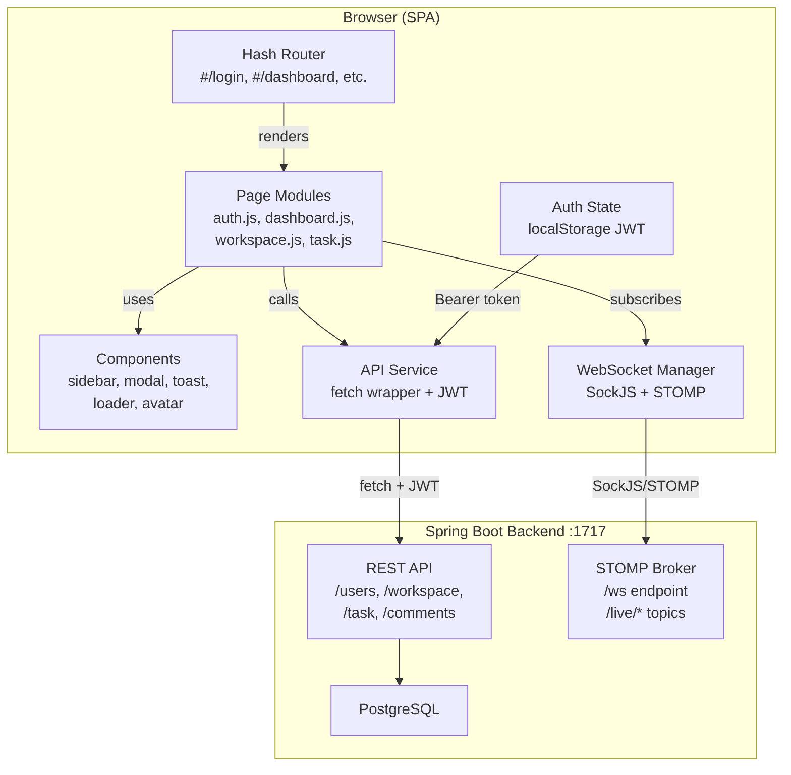
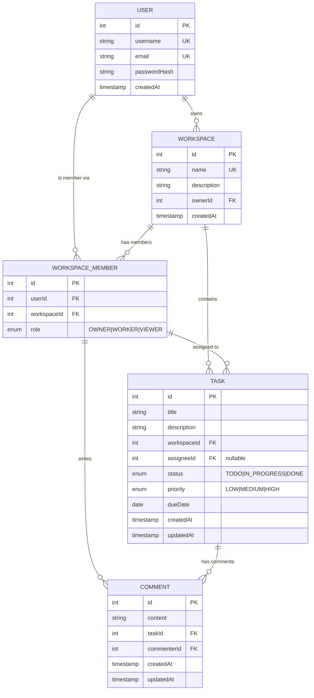

# 🚀 TaskCollab Frontend — Implementation Plan

## Goal

Build a complete, premium, dark-themed **Single Page Application (SPA)** frontend for the existing TaskCollab Spring Boot backend using **only HTML, CSS, and vanilla JavaScript**. The frontend will consume all REST API endpoints and WebSocket topics, provide role-aware UI, and deliver a polished user experience with glassmorphism, micro-animations, and responsive design.

> [!IMPORTANT]
> **Companion Document:** The [UI/UX Design Guide](UI_UX_GUIDE.md) defines all visual specs (colors, typography, component styles). This plan focuses on **architecture, file structure, and implementation**.

---

## User Review Required

> [!IMPORTANT]
> **Frontend Port:** The backend CORS config allows `http://localhost:8084`. The frontend will be served on **port 8084** via a simple static server (e.g., `npx serve` or VS Code Live Server configured to port 8084). Please confirm this is acceptable.

> [!WARNING]
> **WebSocket Auth:** The backend's WebSocket endpoint `/ws` is publicly accessible (no JWT auth on STOMP connections). This means anyone could subscribe to comment topics if they know a taskId. This is a backend limitation — the frontend will still send JWT tokens where possible but cannot enforce WS auth.

> [!IMPORTANT]
> **No Single-Resource Endpoints:** The backend has no `GET /task/{taskId}` or `GET /comment/{commentId}` endpoints. The frontend will fetch all tasks for a workspace and find the specific task client-side. Similarly for comments by task.

---

## Open Questions

> [!IMPORTANT]
> **Drag & Drop Kanban?** Should task cards be draggable between Kanban columns to change status? Note: only the task **assignee** can change status per backend rules, so drag-and-drop would only work for the assignee's own tasks. I can implement it with that restriction.

> [!IMPORTANT]
> **Local Development Server:** Do you have a preference for the static file server? Options:
> - `npx serve -l 8084` (zero-config, one command)
> - VS Code Live Server extension (configure port to 8084)
> - Python `http.server` on port 8084

---

## Architecture Overview



### Entity Relationship Model



---

## Full API Endpoint Map

Every endpoint the frontend will consume:

### User Endpoints
| Method | Endpoint | Auth | Request | Response |
|--------|----------|------|---------|----------|
| `POST` | `/users/create` | ❌ | `{username, email, password}` | `{userId, username, email}` |
| `POST` | `/users/login` | ❌ | `{username, password}` | `{token, username, userId}` |
| `GET` | `/users/me` | ✅ | — | `{userId, username, email}` |
| `GET` | `/users/search?query=` | ❌ | query param | `[{userId, username, email}]` |

### Workspace Endpoints
| Method | Endpoint | Auth | Request | Response |
|--------|----------|------|---------|----------|
| `POST` | `/workspace/create` | ✅ | `{name, description}` | `{workspaceId, name, description, ownerId, ownerName, createdAt}` |
| `GET` | `/workspace/owned` | ✅ | — | `[WorkspaceResponseDto]` |
| `DELETE` | `/workspace/delete?workspaceId=` | ✅ | query param | `200 OK` |
| `POST` | `/workspace/member/add` | ✅ | `{workspaceId, userId, role}` | `{workspaceMemberId, userId, workspaceId, userRole, username, email}` |
| `GET` | `/workspace/member/all?workspaceId=` | ✅ | query param | `[WorkspaceMemberResponse]` |
| `DELETE` | `/workspace/member/delete?memberId=` | ✅ | query param | `200 OK` |
| `PUT` | `/workspace/member/update-role?memberId=&role=` | ✅ | query params | `WorkspaceMemberResponse` |
| `GET` | `/workspace/member/myWorkspaces` | ✅ | — | `[{workspaceId, workspaceName, memberId, role}]` |

### Task Endpoints
| Method | Endpoint | Auth | Request | Response |
|--------|----------|------|---------|----------|
| `GET` | `/task/all/{workspaceId}` | ✅ | path param | `[TaskResponse]` |
| `POST` | `/task/create` | ✅ | `{title, description, workspaceId, assigneeMemberId?, status, priority, dueDate}` | `TaskResponse` |
| `GET` | `/task/all?memberId=` | ✅ | query param | `[TaskResponse]` |
| `PUT` | `/task/assign?taskId=&assigneeId=` | ✅ | query params | `TaskResponse` |
| `PUT` | `/task/set-due-date?taskId=&date=` | ✅ | query params (date: dd-MM-yyyy) | `TaskResponse` |
| `PUT` | `/task/status?taskId=&status=` | ✅ | query params | `TaskResponse` |
| `PATCH` | `/task/update?taskId=` | ✅ | `{name?, description?, priority?}` | `TaskResponse` |
| `DELETE` | `/task/delete?taskId=` | ✅ | query param | `200 OK` |

### Comment Endpoints
| Method | Endpoint | Auth | Request | Response |
|--------|----------|------|---------|----------|
| `GET` | `/comments/task/{taskId}` | ✅ | path param | `[CommentResponse]` |
| `POST` | `/comments/add` | ✅ | `{content, taskId}` | `CommentResponse` |
| `PATCH` | `/comments/edit/{commentId}` | ✅ | `{content, taskId}` | `CommentResponse` |
| `DELETE` | `/comments/delete/{commentId}` | ✅ | path param | `200 OK` |

### WebSocket Topics (STOMP over SockJS)
| Topic | Event | Payload |
|-------|-------|---------|
| `/live/task/{taskId}/comments` | New comment | `CommentResponse` |
| `/live/task/{taskId}/comments/update` | Comment edited | `CommentResponse` |
| `/live/task/{taskId}/comments/delete` | Comment deleted | `commentId` (integer) |

---

## Proposed Changes

### Project File Structure

```
D:\Spring boot\task_collap\
└── frontend/                          ← NEW directory
    ├── index.html                     ← SPA entry point
    ├── css/
    │   ├── variables.css              ← Design tokens (colors, fonts, spacing)
    │   ├── reset.css                  ← CSS reset / normalize
    │   ├── base.css                   ← Base typography, body, scrollbar
    │   ├── layout.css                 ← App shell: sidebar + main layout
    │   ├── components.css             ← All reusable component styles
    │   ├── pages.css                  ← Page-specific styles
    │   └── animations.css             ← Keyframes, transitions, loaders
    ├── js/
    │   ├── app.js                     ← Entry point: init, router mount
    │   ├── core/
    │   │   ├── router.js              ← Hash-based SPA router
    │   │   ├── api.js                 ← API fetch wrapper with JWT
    │   │   ├── auth.js                ← Auth state (login/logout/token)
    │   │   ├── websocket.js           ← STOMP/SockJS WebSocket manager
    │   │   └── utils.js               ← Date formatting, initials, etc.
    │   ├── components/
    │   │   ├── sidebar.js             ← Sidebar navigation component
    │   │   ├── modal.js               ← Reusable modal factory
    │   │   ├── toast.js               ← Toast notification system
    │   │   ├── loader.js              ← Loading spinners & skeletons
    │   │   ├── avatar.js              ← User avatar (initials) component
    │   │   ├── badge.js               ← Status/Priority/Role badges
    │   │   ├── dropdown.js            ← Custom dropdown select
    │   │   └── confirm-dialog.js      ← Confirmation dialog
    │   └── pages/
    │       ├── auth.js                ← Login / Register page
    │       ├── dashboard.js           ← Dashboard with workspace cards
    │       ├── workspace.js           ← Workspace detail (Kanban + Members)
    │       └── task-detail.js         ← Task detail slide-over panel
    ├── assets/
    │   └── icons.svg                  ← SVG sprite sheet (all icons)
    └── lib/
        ├── sockjs.min.js              ← SockJS client library
        └── stomp.min.js               ← STOMP.js client library
```

> **Total: ~30 files** across 4 directories

---

### Phase 1: Foundation (CSS Design System + App Shell)

#### [NEW] `frontend/index.html`

The single HTML page that boots the SPA:

```html
<!DOCTYPE html>
<html lang="en">
<head>
  <meta charset="UTF-8">
  <meta name="viewport" content="width=device-width, initial-scale=1.0">
  <meta name="description" content="TaskCollab — Collaborate. Organize. Deliver.">
  <title>TaskCollab</title>
  <link rel="preconnect" href="https://fonts.googleapis.com">
  <link href="https://fonts.googleapis.com/css2?family=Inter:wght@400;500;600;700&display=swap" rel="stylesheet">
  <link rel="stylesheet" href="css/variables.css">
  <link rel="stylesheet" href="css/reset.css">
  <link rel="stylesheet" href="css/base.css">
  <link rel="stylesheet" href="css/layout.css">
  <link rel="stylesheet" href="css/components.css">
  <link rel="stylesheet" href="css/pages.css">
  <link rel="stylesheet" href="css/animations.css">
</head>
<body>
  <div id="app">
    <!-- Sidebar (injected by JS when authenticated) -->
    <aside id="sidebar"></aside>
    <!-- Main content area (pages render here) -->
    <main id="main-content"></main>
  </div>
  <!-- Toast container -->
  <div id="toast-container"></div>
  <!-- Modal container -->
  <div id="modal-container"></div>

  <!-- External Libraries -->
  <script src="lib/sockjs.min.js"></script>
  <script src="lib/stomp.min.js"></script>
  <!-- Core modules -->
  <script src="js/core/utils.js"></script>
  <script src="js/core/api.js"></script>
  <script src="js/core/auth.js"></script>
  <script src="js/core/router.js"></script>
  <script src="js/core/websocket.js"></script>
  <!-- Components -->
  <script src="js/components/toast.js"></script>
  <script src="js/components/loader.js"></script>
  <script src="js/components/avatar.js"></script>
  <script src="js/components/badge.js"></script>
  <script src="js/components/modal.js"></script>
  <script src="js/components/dropdown.js"></script>
  <script src="js/components/confirm-dialog.js"></script>
  <script src="js/components/sidebar.js"></script>
  <!-- Pages -->
  <script src="js/pages/auth.js"></script>
  <script src="js/pages/dashboard.js"></script>
  <script src="js/pages/workspace.js"></script>
  <script src="js/pages/task-detail.js"></script>
  <!-- App init -->
  <script src="js/app.js"></script>
</body>
</html>
```

---

#### [NEW] `frontend/css/variables.css`

All design tokens from the UI/UX guide as CSS custom properties:

```css
:root {
  /* Backgrounds */
  --bg-primary: #0f1117;
  --bg-secondary: #161923;
  --bg-tertiary: #1e2230;
  --bg-hover: #262b3d;
  --bg-glass: rgba(30, 34, 48, 0.7);
  --bg-glass-border: rgba(255, 255, 255, 0.06);

  /* Accent Primary */
  --accent-primary: #6366f1;
  --accent-primary-hover: #818cf8;
  --accent-primary-glow: rgba(99, 102, 241, 0.25);
  --accent-primary-muted: rgba(99, 102, 241, 0.12);

  /* Accent Secondary */
  --accent-secondary: #f59e0b;

  /* Text */
  --text-primary: #f1f5f9;
  --text-secondary: #94a3b8;
  --text-tertiary: #64748b;

  /* Status / Priority / Role / Semantic colors */
  --status-todo: #6366f1;
  --status-in-progress: #f59e0b;
  --status-done: #22c55e;
  --priority-high: #ef4444;
  --priority-medium: #f59e0b;
  --priority-low: #22c55e;
  --role-owner: #f59e0b;
  --role-worker: #6366f1;
  --role-viewer: #64748b;
  --success: #22c55e;
  --error: #ef4444;
  --warning: #f59e0b;
  --info: #3b82f6;

  /* Borders */
  --border-default: rgba(255, 255, 255, 0.06);
  --border-hover: rgba(255, 255, 255, 0.12);

  /* Typography */
  --font-primary: 'Inter', -apple-system, BlinkMacSystemFont, sans-serif;
  --text-xs: 0.75rem; --text-sm: 0.875rem; --text-base: 1rem;
  --text-lg: 1.125rem; --text-xl: 1.25rem; --text-2xl: 1.5rem;
  --text-3xl: 1.875rem; --text-4xl: 2.25rem;

  /* Spacing */
  --space-1: 4px; --space-2: 8px; --space-3: 12px; --space-4: 16px;
  --space-5: 24px; --space-6: 48px; --space-7: 56px; --space-8: 64px;

  /* Radius */
  --radius-sm: 6px; --radius-md: 8px; --radius-lg: 12px;
  --radius-xl: 16px; --radius-full: 9999px;

  /* Shadows */
  --shadow-sm: 0 1px 3px rgba(0,0,0,0.3);
  --shadow-md: 0 4px 12px rgba(0,0,0,0.4);
  --shadow-lg: 0 8px 24px rgba(0,0,0,0.5);
  --shadow-xl: 0 16px 48px rgba(0,0,0,0.6);

  /* Transitions */
  --ease-out: cubic-bezier(0.16, 1, 0.3, 1);

  /* Layout */
  --sidebar-width: 260px;
  --sidebar-collapsed: 64px;
}
```

---

#### [NEW] `frontend/css/reset.css`, `base.css`, `layout.css`

- **reset.css** — Box-sizing border-box, margin/padding reset, smooth-scroll
- **base.css** — Body with `--bg-primary`, `--font-primary`, custom scrollbar (dark theme), `::selection` styling
- **layout.css** — App shell grid: sidebar (fixed) + main (flex, margin-left = sidebar width), responsive breakpoints

---

#### [NEW] `frontend/css/components.css`

All component styles from the UI/UX guide:
- `.btn`, `.btn-primary`, `.btn-secondary`, `.btn-danger`, `.btn-icon`
- `.input`, `.input-group`, `.input-error`
- `.card`, `.card-glass`
- `.badge`, `.badge-status-*`, `.badge-priority-*`, `.badge-role-*`
- `.avatar`, `.avatar-sm`, `.avatar-lg`
- `.modal-overlay`, `.modal-panel`
- `.toast`, `.toast-success`, `.toast-error`, `.toast-info`
- `.sidebar`, `.nav-item`, `.nav-item-active`
- `.slide-over`, `.slide-over-backdrop`
- `.tab-bar`, `.tab-item`, `.tab-indicator`
- `.breadcrumb`
- `.empty-state`
- `.skeleton`, `.skeleton-shimmer`

---

#### [NEW] `frontend/css/pages.css`

Page-specific styles:
- `.auth-page` — Split screen, left branding panel, right form panel
- `.dashboard-page` — Workspace card grid, section headers
- `.workspace-page` — Kanban board columns, member table
- `.task-detail` — Slide-over panel internal layout, comments section

---

#### [NEW] `frontend/css/animations.css`

```css
@keyframes fadeIn { from { opacity: 0 } to { opacity: 1 } }
@keyframes slideUp { from { transform: translateY(20px); opacity: 0 } to { transform: translateY(0); opacity: 1 } }
@keyframes slideInRight { from { transform: translateX(100%) } to { transform: translateX(0) } }
@keyframes slideOutRight { from { transform: translateX(0) } to { transform: translateX(100%) } }
@keyframes shimmer { 0% { background-position: -200% 0 } 100% { background-position: 200% 0 } }
@keyframes spin { to { transform: rotate(360deg) } }
@keyframes shake { 0%,100% { transform: translateX(0) } 25% { transform: translateX(-5px) } 75% { transform: translateX(5px) } }
@keyframes pulse { 0%,100% { opacity: 1 } 50% { opacity: 0.6 } }

/* Reduced motion preference */
@media (prefers-reduced-motion: reduce) {
  *, *::before, *::after { animation-duration: 0.01ms !important; transition-duration: 0.01ms !important; }
}
```

---

### Phase 2: Core JavaScript Modules

#### [NEW] `frontend/js/core/api.js` — API Service

Centralized fetch wrapper with JWT management:

```javascript
const API = {
  BASE_URL: 'http://localhost:1717',

  async request(method, path, body = null) {
    const headers = { 'Content-Type': 'application/json' };
    const token = Auth.getToken();
    if (token) headers['Authorization'] = `Bearer ${token}`;

    const options = { method, headers, credentials: 'include' };
    if (body) options.body = JSON.stringify(body);

    const response = await fetch(`${this.BASE_URL}${path}`, options);

    if (response.status === 401) {
      Auth.logout();
      Router.navigate('/login');
      throw new Error('Session expired');
    }
    if (!response.ok) {
      const error = await response.json().catch(() => ({ message: response.statusText }));
      throw { status: response.status, ...error };
    }
    if (response.status === 204 || response.headers.get('content-length') === '0') return null;
    return response.json();
  },

  // User endpoints
  register: (data) => API.request('POST', '/users/create', data),
  login: (data) => API.request('POST', '/users/login', data),
  getMe: () => API.request('GET', '/users/me'),
  searchUsers: (query) => API.request('GET', `/users/search?query=${encodeURIComponent(query)}`),

  // Workspace endpoints
  createWorkspace: (data) => API.request('POST', '/workspace/create', data),
  getOwnedWorkspaces: () => API.request('GET', '/workspace/owned'),
  getMemberWorkspaces: () => API.request('GET', '/workspace/member/myWorkspaces'),
  deleteWorkspace: (id) => API.request('DELETE', `/workspace/delete?workspaceId=${id}`),
  addMember: (data) => API.request('POST', '/workspace/member/add', data),
  getMembers: (wsId) => API.request('GET', `/workspace/member/all?workspaceId=${wsId}`),
  deleteMember: (memberId) => API.request('DELETE', `/workspace/member/delete?memberId=${memberId}`),
  updateRole: (memberId, role) => API.request('PUT', `/workspace/member/update-role?memberId=${memberId}&role=${role}`),

  // Task endpoints
  getTasks: (wsId) => API.request('GET', `/task/all/${wsId}`),
  createTask: (data) => API.request('POST', '/task/create', data),
  getMyTasks: (memberId) => API.request('GET', `/task/all?memberId=${memberId}`),
  assignTask: (taskId, assigneeId) => API.request('PUT', `/task/assign?taskId=${taskId}&assigneeId=${assigneeId}`),
  setDueDate: (taskId, date) => API.request('PUT', `/task/set-due-date?taskId=${taskId}&date=${date}`),
  changeStatus: (taskId, status) => API.request('PUT', `/task/status?taskId=${taskId}&status=${status}`),
  updateTask: (taskId, data) => API.request('PATCH', `/task/update?taskId=${taskId}`, data),
  deleteTask: (taskId) => API.request('DELETE', `/task/delete?taskId=${taskId}`),

  // Comment endpoints
  getComments: (taskId) => API.request('GET', `/comments/task/${taskId}`),
  addComment: (data) => API.request('POST', '/comments/add', data),
  editComment: (commentId, data) => API.request('PATCH', `/comments/edit/${commentId}`, data),
  deleteComment: (commentId) => API.request('DELETE', `/comments/delete/${commentId}`),
};
```

---

#### [NEW] `frontend/js/core/auth.js` — Auth State

```javascript
const Auth = {
  TOKEN_KEY: 'taskcollab_token',
  USER_KEY: 'taskcollab_user',

  login(loginResponse) {
    localStorage.setItem(this.TOKEN_KEY, loginResponse.token);
    localStorage.setItem(this.USER_KEY, JSON.stringify({
      userId: loginResponse.userId,
      username: loginResponse.username
    }));
  },
  logout() {
    localStorage.removeItem(this.TOKEN_KEY);
    localStorage.removeItem(this.USER_KEY);
    WebSocketManager.disconnect();
  },
  getToken: () => localStorage.getItem(Auth.TOKEN_KEY),
  getUser: () => JSON.parse(localStorage.getItem(Auth.USER_KEY) || 'null'),
  isLoggedIn: () => !!Auth.getToken(),
};
```

---

#### [NEW] `frontend/js/core/router.js` — Hash Router

```javascript
const Router = {
  routes: {},
  currentCleanup: null,

  register(hash, renderFn) {
    this.routes[hash] = renderFn;
  },

  navigate(hash) {
    window.location.hash = hash;
  },

  async resolve() {
    // Cleanup previous page (remove event listeners, WS subscriptions)
    if (this.currentCleanup) this.currentCleanup();

    const hash = window.location.hash.slice(1) || '/login';
    const [path, ...paramParts] = hash.split('/').filter(Boolean);

    // Auth guard
    if (path !== 'login' && path !== 'register' && !Auth.isLoggedIn()) {
      return this.navigate('/login');
    }
    if ((path === 'login' || path === 'register') && Auth.isLoggedIn()) {
      return this.navigate('/dashboard');
    }

    // Route matching: /workspace/:id, /workspace/:id/members
    let renderFn = this.routes[`/${path}`];
    let params = {};

    if (path === 'workspace' && paramParts[0]) {
      params.workspaceId = paramParts[0];
      if (paramParts[1] === 'members') {
        renderFn = this.routes['/workspace/members'];
      } else {
        renderFn = this.routes['/workspace'];
      }
    }

    if (renderFn) {
      this.currentCleanup = await renderFn(params) || null;
    }
  },

  init() {
    window.addEventListener('hashchange', () => this.resolve());
    this.resolve();
  }
};
```

**Routes:**
| Hash | Page | Description |
|------|------|-------------|
| `#/login` | Auth | Login form |
| `#/register` | Auth | Register form |
| `#/dashboard` | Dashboard | Workspace overview |
| `#/workspace/{id}` | Workspace | Kanban board view |
| `#/workspace/{id}/members` | Workspace | Members tab |

---

#### [NEW] `frontend/js/core/websocket.js` — WebSocket Manager

```javascript
const WebSocketManager = {
  stompClient: null,
  subscriptions: {},

  connect() {
    if (this.stompClient?.connected) return;
    const socket = new SockJS('http://localhost:1717/ws');
    this.stompClient = Stomp.over(socket);
    this.stompClient.debug = null; // suppress console logs
    this.stompClient.connect({}, () => {
      console.log('WebSocket connected');
    }, (error) => {
      console.error('WebSocket error:', error);
      setTimeout(() => this.connect(), 5000); // auto-reconnect
    });
  },

  subscribeToTaskComments(taskId, callbacks) {
    if (!this.stompClient?.connected) return;
    const subs = [];
    subs.push(this.stompClient.subscribe(
      `/live/task/${taskId}/comments`,
      (msg) => callbacks.onNew?.(JSON.parse(msg.body))
    ));
    subs.push(this.stompClient.subscribe(
      `/live/task/${taskId}/comments/update`,
      (msg) => callbacks.onUpdate?.(JSON.parse(msg.body))
    ));
    subs.push(this.stompClient.subscribe(
      `/live/task/${taskId}/comments/delete`,
      (msg) => callbacks.onDelete?.(JSON.parse(msg.body))
    ));
    this.subscriptions[taskId] = subs;
  },

  unsubscribeFromTask(taskId) {
    this.subscriptions[taskId]?.forEach(sub => sub.unsubscribe());
    delete this.subscriptions[taskId];
  },

  disconnect() {
    Object.keys(this.subscriptions).forEach(id => this.unsubscribeFromTask(id));
    this.stompClient?.disconnect();
    this.stompClient = null;
  }
};
```

---

#### [NEW] `frontend/js/core/utils.js` — Utilities

```javascript
const Utils = {
  // Generate initials from username ("alice" → "A", "bob_smith" → "BS")
  getInitials(name) {
    return name.split(/[_\s-]/).map(w => w[0]).join('').toUpperCase().slice(0, 2);
  },

  // Deterministic color from string (for avatars)
  getAvatarColor(name) {
    const colors = ['#6366f1','#ec4899','#f59e0b','#22c55e','#3b82f6','#a855f7'];
    let hash = 0;
    for (const ch of name) hash = ch.charCodeAt(0) + ((hash << 5) - hash);
    return colors[Math.abs(hash) % colors.length];
  },

  // Relative time: "2 min ago", "1 hour ago"
  timeAgo(dateStr) {
    const diff = (Date.now() - new Date(dateStr)) / 1000;
    if (diff < 60) return 'just now';
    if (diff < 3600) return `${Math.floor(diff/60)}m ago`;
    if (diff < 86400) return `${Math.floor(diff/3600)}h ago`;
    return `${Math.floor(diff/86400)}d ago`;
  },

  // Format date for display: "Jul 10, 2026"
  formatDate(dateStr) {
    if (!dateStr) return '—';
    return new Date(dateStr).toLocaleDateString('en-US', {
      month: 'short', day: 'numeric', year: 'numeric'
    });
  },

  // Format date for API: "dd-MM-yyyy"
  formatDateForApi(date) {
    const d = new Date(date);
    return `${String(d.getDate()).padStart(2,'0')}-${String(d.getMonth()+1).padStart(2,'0')}-${d.getFullYear()}`;
  },

  // Check if date is overdue
  isOverdue(dateStr) {
    if (!dateStr) return false;
    return new Date(dateStr) < new Date();
  },

  // Debounce
  debounce(fn, ms = 300) {
    let timer;
    return (...args) => { clearTimeout(timer); timer = setTimeout(() => fn(...args), ms); };
  },

  // Sanitize HTML to prevent XSS
  escapeHtml(str) {
    const div = document.createElement('div');
    div.textContent = str;
    return div.innerHTML;
  }
};
```

---

### Phase 3: Components

Each component is a JavaScript object/namespace that creates and manages DOM elements:

#### [NEW] `frontend/js/components/sidebar.js`
- Renders sidebar with nav items, user profile, logout
- Highlights active route
- Collapse/expand toggle
- Updates on route changes
- Displays workspace sub-nav when inside a workspace

#### [NEW] `frontend/js/components/modal.js`
```javascript
const Modal = {
  show(title, contentHtml, { onSubmit, submitText = 'Save', onClose } = {}) {
    const container = document.getElementById('modal-container');
    container.innerHTML = `
      <div class="modal-overlay" data-modal-backdrop>
        <div class="modal-panel animate-slideUp">
          <div class="modal-header">
            <h3>${title}</h3>
            <button class="btn-icon modal-close">${Icons.close}</button>
          </div>
          <div class="modal-body">${contentHtml}</div>
          <div class="modal-footer">
            <button class="btn btn-secondary" data-modal-cancel>Cancel</button>
            ${onSubmit ? `<button class="btn btn-primary" data-modal-submit>${submitText}</button>` : ''}
          </div>
        </div>
      </div>`;
    // Event delegation for close, submit, backdrop click...
  },
  close() { document.getElementById('modal-container').innerHTML = ''; }
};
```

#### [NEW] `frontend/js/components/toast.js`
- `Toast.success(message)`, `Toast.error(message)`, `Toast.info(message)`
- Auto-dismiss after 4 seconds with slide-out animation
- Stacks multiple toasts vertically

#### [NEW] `frontend/js/components/loader.js`
- `Loader.spinner()` — returns spinner HTML
- `Loader.skeleton(type)` — returns skeleton HTML (card grid, table, etc.)
- `Loader.fullPage()` — full-page centered spinner

#### [NEW] `frontend/js/components/avatar.js`
- `Avatar.render(username, size = 'md')` — returns avatar HTML with initials and deterministic color

#### [NEW] `frontend/js/components/badge.js`
- `Badge.status(status)` — returns status badge HTML
- `Badge.priority(priority)` — returns priority badge HTML
- `Badge.role(role)` — returns role badge HTML

#### [NEW] `frontend/js/components/dropdown.js`
- Custom dropdown with search support for assignee selection
- Handles keyboard navigation

#### [NEW] `frontend/js/components/confirm-dialog.js`
- `ConfirmDialog.show({ title, message, confirmText, danger })` — returns Promise<boolean>
- Used before destructive actions (delete workspace, task, member)

---

### Phase 4: Pages

#### [NEW] `frontend/js/pages/auth.js` — Login & Register

```javascript
const AuthPage = {
  render(mode = 'login') {
    const main = document.getElementById('main-content');
    document.getElementById('sidebar').innerHTML = ''; // No sidebar on auth
    main.className = 'auth-page';

    main.innerHTML = `
      <div class="auth-left">
        <div class="auth-branding">
          <h1 class="auth-logo">TaskCollab</h1>
          <p class="auth-tagline">Collaborate. Organize. Deliver.</p>
        </div>
        <div class="auth-shapes"><!-- Animated geometric shapes via CSS --></div>
      </div>
      <div class="auth-right">
        <div class="auth-card card-glass">
          <h2 id="auth-title">${mode === 'login' ? 'Welcome Back' : 'Create Account'}</h2>
          <form id="auth-form" novalidate>
            ${mode === 'register' ? '<div class="input-group"><input id="reg-username" placeholder="Username" required></div>' : ''}
            ${mode === 'register' ? '<div class="input-group"><input id="reg-email" type="email" placeholder="Email" required></div>' : ''}
            ${mode === 'login' ? '<div class="input-group"><input id="login-username" placeholder="Username" required></div>' : ''}
            <div class="input-group">
              <input id="auth-password" type="password" placeholder="Password" required>
              <button type="button" class="btn-icon password-toggle">${Icons.eyeOff}</button>
            </div>
            <button type="submit" class="btn btn-primary btn-full">
              ${mode === 'login' ? 'Sign In' : 'Create Account'}
            </button>
          </form>
          <p class="auth-switch">
            ${mode === 'login'
              ? 'Don\'t have an account? <a href="#/register">Create one</a>'
              : 'Already have an account? <a href="#/login">Sign In</a>'}
          </p>
        </div>
      </div>`;

    // Form submit handler → API.login() or API.register()
    // On success: Auth.login(response), Router.navigate('/dashboard')
    // On error: show inline error, shake animation
  }
};
```

---

#### [NEW] `frontend/js/pages/dashboard.js` — Dashboard

**Data flow:**
1. Call `API.getOwnedWorkspaces()` and `API.getMemberWorkspaces()` in parallel
2. Render workspace cards in two sections
3. "Create Workspace" button → Modal with form → `API.createWorkspace()`

**Key elements:**
- Top bar with search filter (client-side filtering of loaded workspaces)
- Responsive grid: `display: grid; grid-template-columns: repeat(auto-fill, minmax(320px, 1fr))`
- Each card: workspace name, description (2-line clamp), owner/role badge, created date
- Click card → `Router.navigate('/workspace/' + id)`
- Empty state with CTA

---

#### [NEW] `frontend/js/pages/workspace.js` — Workspace Detail (Kanban + Members)

This is the most complex page. It has **two tabs**: Tasks (Kanban) and Members.

**Kanban Tab — Data flow:**
1. Fetch `API.getTasks(workspaceId)` + `API.getMembers(workspaceId)`
2. Determine current user's role from members list
3. Group tasks by `status` into 3 columns: TODO, IN_PROGRESS, DONE
4. Render Kanban board
5. Connect WebSocket for real-time comment count updates

**Kanban rendering logic:**
```javascript
function renderKanban(tasks) {
  const columns = {
    TODO: tasks.filter(t => t.status === 'TODO'),
    IN_PROGRESS: tasks.filter(t => t.status === 'IN_PROGRESS'),
    DONE: tasks.filter(t => t.status === 'DONE')
  };
  // For each column, render header + scrollable card list
  // Each card: title, priority badge, assignee avatar, due date, comment icon
  // Card click → TaskDetail.open(task)
}
```

**Create Task (Owner only):**
- Button visible only if user role = OWNER
- Modal form with title, description, assignee dropdown (non-VIEWER members), status, priority, due date
- On success: add card to appropriate column, show toast

**Members Tab — Data flow:**
1. Fetch `API.getMembers(workspaceId)`
2. Render member list/table
3. Owner sees: role dropdown, remove button per member
4. "Add Member" button → Modal with user search → `API.addMember()`

**Add Member flow:**
1. Search input with debounce → `API.searchUsers(query)`
2. Display results with "Add" button
3. Role selector (WORKER / VIEWER)
4. On add success: refresh member list, toast

---

#### [NEW] `frontend/js/pages/task-detail.js` — Task Detail Slide-Over

**Opens as a slide-over panel** on top of the Kanban board (not a separate route — it's a UI overlay triggered by clicking a task card).

**Data flow:**
1. Receive task object from workspace page
2. Fetch `API.getComments(taskId)` 
3. Connect WebSocket: `WebSocketManager.subscribeToTaskComments(taskId, { onNew, onUpdate, onDelete })`
4. Render all task details + comments

**Inline editing (Owner only):**
- Title: click to edit → input field → blur/Enter saves via `API.updateTask()`
- Description: click to edit → textarea → saves on blur
- Priority: dropdown → `API.updateTask()`
- Assignee: dropdown → `API.assignTask()`
- Due Date: date input → `API.setDueDate()`

**Status change (Assignee only):**
- Dropdown → `API.changeStatus()` → card moves to new column on Kanban (UI update)

**Comments section:**
- Chronological list, scrolled to bottom
- Real-time updates via WebSocket:
  - `onNew`: append comment to list, scroll to bottom
  - `onUpdate`: find and replace comment content
  - `onDelete`: remove comment from DOM
- Each comment: avatar, username, content, relative timestamp, edit/delete icons on hover
- New comment input + send button (visible only to assignee or owner)
- Edit: inline textarea replaces content → `API.editComment()`
- Delete: confirm dialog → `API.deleteComment()`

**Cleanup function returned:**
```javascript
// Called when navigating away
return () => {
  WebSocketManager.unsubscribeFromTask(taskId);
  slideOverPanel.remove();
};
```

---

#### [NEW] `frontend/js/app.js` — Main Entry Point

```javascript
// Register all routes
Router.register('/login', () => AuthPage.render('login'));
Router.register('/register', () => AuthPage.render('register'));
Router.register('/dashboard', () => DashboardPage.render());
Router.register('/workspace', (params) => WorkspacePage.render(params.workspaceId, 'tasks'));
Router.register('/workspace/members', (params) => WorkspacePage.render(params.workspaceId, 'members'));

// Boot
document.addEventListener('DOMContentLoaded', () => {
  if (Auth.isLoggedIn()) {
    WebSocketManager.connect();
    Sidebar.render();
  }
  Router.init();
});
```

---

### Phase 5: Assets & Libraries

#### [NEW] `frontend/assets/icons.svg`
SVG sprite sheet with all icons listed in UI/UX guide § 6. Each icon as a `<symbol>` element, used via:
```html
<svg class="icon"><use href="assets/icons.svg#icon-name"></use></svg>
```

#### [NEW] `frontend/lib/sockjs.min.js` & `stomp.min.js`
Downloaded from CDN:
- SockJS: `https://cdn.jsdelivr.net/npm/sockjs-client@1/dist/sockjs.min.js`
- STOMP: `https://cdn.jsdelivr.net/npm/@stomp/stompjs@7/bundles/stomp.umd.min.js`

---

## Implementation Order

```mermaid
gantt
    title TaskCollab Frontend Implementation
    dateFormat X
    axisFormat %s

    section Phase 1: Foundation
    CSS Design System (variables, reset, base)     :p1a, 0, 1
    Layout & Component CSS                         :p1b, 1, 2
    Page CSS & Animations                          :p1c, 2, 3
    index.html + SVG icons                         :p1d, 2, 3

    section Phase 2: Core JS
    utils.js + api.js + auth.js                    :p2a, 3, 4
    router.js                                      :p2b, 4, 5
    websocket.js                                   :p2c, 4, 5

    section Phase 3: Components
    Toast, Loader, Avatar, Badge                   :p3a, 5, 6
    Modal, Dropdown, ConfirmDialog                 :p3b, 6, 7
    Sidebar                                        :p3c, 7, 8

    section Phase 4: Pages
    Auth page (login/register)                     :p4a, 8, 9
    Dashboard page                                 :p4b, 9, 10
    Workspace page (Kanban + Members)              :p4c, 10, 12
    Task Detail slide-over + WebSocket             :p4d, 12, 14

    section Phase 5: Polish
    Responsive design fine-tuning                  :p5a, 14, 15
    Error handling, edge cases                     :p5b, 14, 15
    Final testing & cleanup                        :p5c, 15, 16
```



**Estimated files: ~30 | Phases: 5 | Dependencies flow top-down**

---

## Verification Plan

### Automated Tests
No frontend test framework is used (vanilla JS). Verification is manual against the live backend.

**Pre-requisite commands:**
```bash
# Start PostgreSQL (if not already running)
docker-compose up -d

# Start Spring Boot backend
./mvnw spring-boot:run

# Serve frontend (from frontend/ directory)
npx -y serve -l 8084
```

### Manual Verification Checklist

#### Auth Flow
- [ ] Register new user → success toast, redirects to dashboard
- [ ] Register duplicate username → error "Username already taken"
- [ ] Register duplicate email → error "Email already taken"
- [ ] Login with valid credentials → redirects to dashboard, JWT stored
- [ ] Login with wrong password → error toast
- [ ] Access `#/dashboard` without login → redirected to `#/login`
- [ ] Logout → clears token, redirects to login

#### Dashboard
- [ ] Owned workspaces displayed with OWNER badge
- [ ] Member workspaces displayed with role badge
- [ ] Create workspace → card appears, success toast
- [ ] Click workspace card → navigates to workspace detail
- [ ] Empty state shown when no workspaces

#### Workspace — Kanban
- [ ] Tasks grouped correctly in 3 columns (TODO, IN_PROGRESS, DONE)
- [ ] Task cards show title, priority badge, assignee, due date
- [ ] Owner can see "Create Task" button, non-owners cannot
- [ ] Create task → card appears in correct column
- [ ] Click task card → slide-over opens

#### Workspace — Members
- [ ] All members listed with role badges
- [ ] Owner sees role dropdown and remove button (not on self)
- [ ] Add member via search → member appears in list
- [ ] Change member role → badge updates
- [ ] Remove member → removed from list with confirmation

#### Task Detail
- [ ] All task fields displayed correctly
- [ ] Owner can inline-edit title, description, priority
- [ ] Owner can reassign task, set due date
- [ ] Assignee can change status → card moves in Kanban
- [ ] Comments load chronologically
- [ ] Add comment → appears immediately
- [ ] WebSocket: open task in 2 tabs, comment in one → appears in other
- [ ] Edit comment → content updates (only own comments)
- [ ] Delete comment → removed (own or owner)
- [ ] Non-assignee/non-owner cannot see comment input

#### Responsive Design
- [ ] Desktop (>1200px): full sidebar + 3-column Kanban
- [ ] Tablet (768–1200px): collapsed sidebar, horizontal scroll Kanban
- [ ] Mobile (<768px): hamburger menu, tabbed Kanban columns
- [ ] Task detail is full-screen on mobile

#### Error Handling
- [ ] Network error → error toast with retry
- [ ] 401 on any API call → redirect to login with "Session expired" toast
- [ ] Empty/invalid form submission → inline validation errors
- [ ] 409 on add member → "Already a member" error
