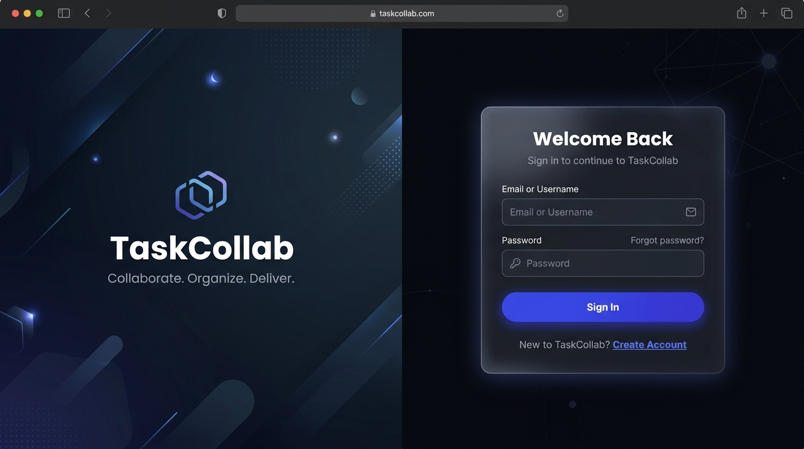
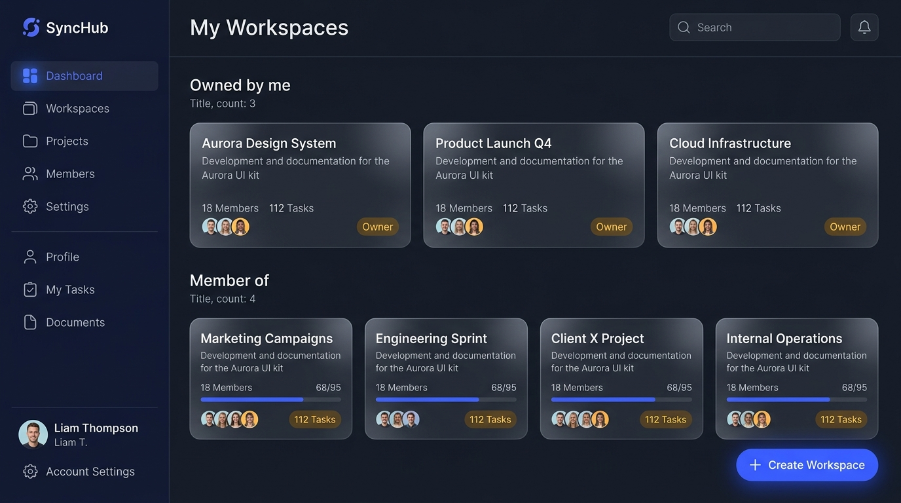
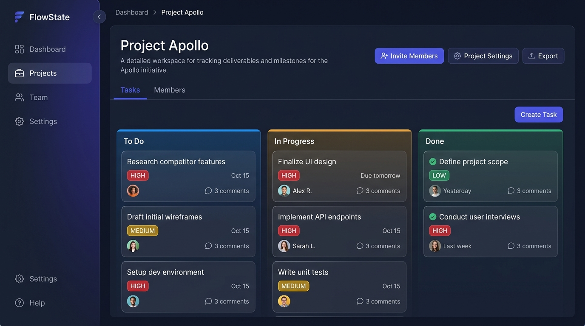
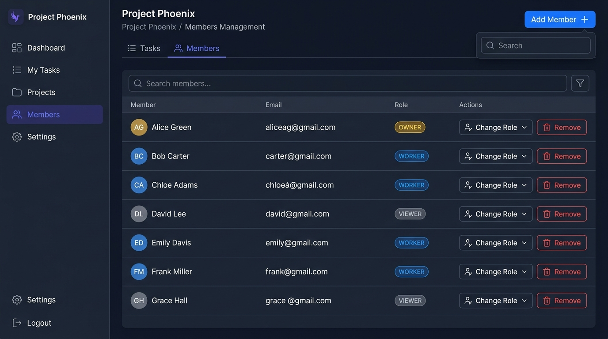
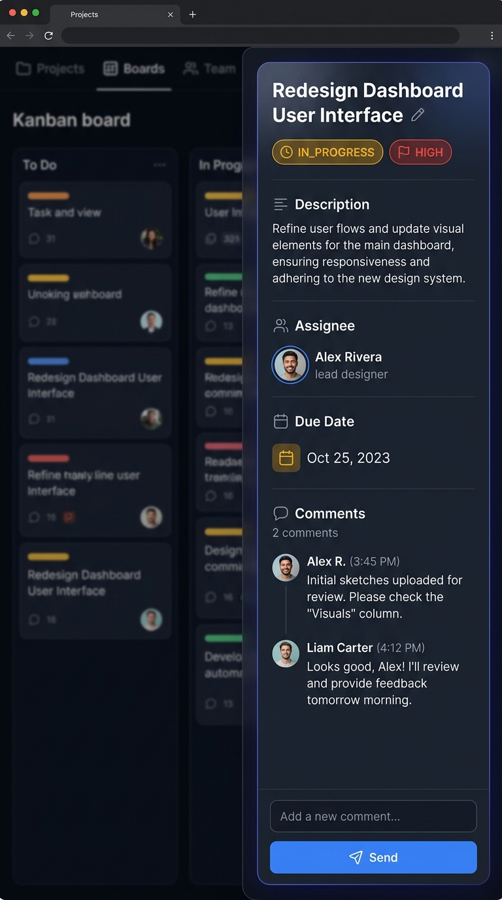
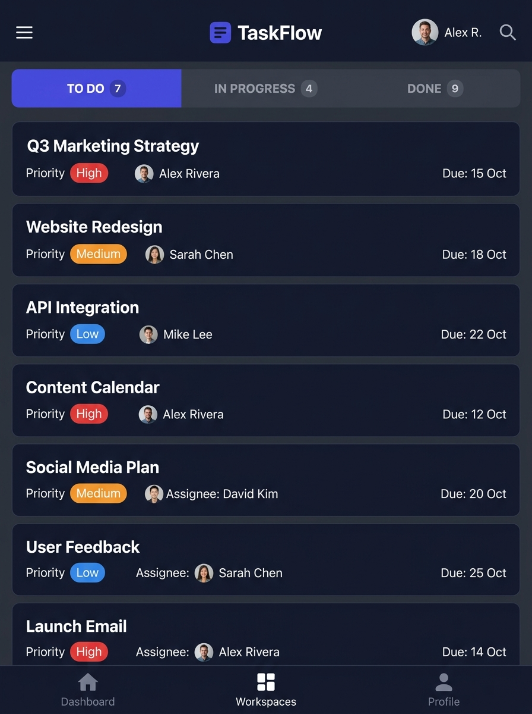

# 🎨 TaskCollab — UI/UX Design Guide

> **This document is the single source of truth for the visual design, interaction patterns, and component specifications of the TaskCollab frontend.**

---

## 1. Design Philosophy

TaskCollab is a **premium, dark-themed task collaboration platform**. The design follows these core principles:

| Principle | Description |
|-----------|-------------|
| **Dark Elegance** | Deep navy/charcoal backgrounds with vibrant accent colors create a sophisticated, modern feel |
| **Glassmorphism** | Frosted-glass card effects with subtle translucency add depth and premium quality |
| **Motion & Life** | Micro-animations, smooth transitions, and hover effects make the UI feel alive |
| **Clarity First** | Strong visual hierarchy through color, spacing, and typography ensures information is scannable |
| **Role-Aware** | UI dynamically adapts based on user roles (Owner, Worker, Viewer) — showing/hiding controls accordingly |

---

## 2. Visual Identity

### 2.1 Color Palette

```
DESIGN TOKENS — COLOR SYSTEM
═══════════════════════════════════════════════════

BACKGROUNDS
  --bg-primary:       #0f1117    (App background — deepest layer)
  --bg-secondary:     #161923    (Sidebar, panels)
  --bg-tertiary:      #1e2230    (Cards, elevated surfaces)
  --bg-hover:         #262b3d    (Hover state on surfaces)
  --bg-glass:         rgba(30, 34, 48, 0.7)  (Glassmorphism fill)
  --bg-glass-border:  rgba(255, 255, 255, 0.06) (Glass border)

ACCENT — PRIMARY (Indigo/Electric Blue)
  --accent-primary:       #6366f1   (Buttons, active states, links)
  --accent-primary-hover: #818cf8   (Button hover)
  --accent-primary-glow:  rgba(99, 102, 241, 0.25) (Glow effects)
  --accent-primary-muted: rgba(99, 102, 241, 0.12) (Subtle backgrounds)

ACCENT — SECONDARY (Amber/Orange)
  --accent-secondary:       #f59e0b   (Warnings, attention, OWNER badge)
  --accent-secondary-hover: #fbbf24
  --accent-secondary-muted: rgba(245, 158, 11, 0.12)

TEXT
  --text-primary:    #f1f5f9    (Headings, primary content)
  --text-secondary:  #94a3b8    (Body text, descriptions)
  --text-tertiary:   #64748b    (Placeholder, muted labels)
  --text-inverse:    #0f1117    (Text on light backgrounds)

SEMANTIC — STATUS
  --status-todo:         #6366f1   (Blue — To Do)
  --status-in-progress:  #f59e0b   (Amber — In Progress)
  --status-done:         #22c55e   (Green — Done)

SEMANTIC — PRIORITY
  --priority-high:    #ef4444   (Red)
  --priority-medium:  #f59e0b   (Amber)
  --priority-low:     #22c55e   (Green)

SEMANTIC — ROLE BADGES
  --role-owner:   #f59e0b   (Gold)
  --role-worker:  #6366f1   (Indigo)
  --role-viewer:  #64748b   (Gray)

SEMANTIC — FEEDBACK
  --success:  #22c55e
  --error:    #ef4444
  --warning:  #f59e0b
  --info:     #3b82f6

BORDERS & DIVIDERS
  --border-default:  rgba(255, 255, 255, 0.06)
  --border-hover:    rgba(255, 255, 255, 0.12)
  --border-focus:    var(--accent-primary)
```

### 2.2 Typography

```
FONT STACK
═══════════════════════════════════════════════════

Primary Font:    'Inter', -apple-system, BlinkMacSystemFont, sans-serif
Mono Font:       'JetBrains Mono', 'Fira Code', monospace

SCALE (1.25 ratio — Major Third)
  --text-xs:    0.75rem   (12px)  — Labels, badges, timestamps
  --text-sm:    0.875rem  (14px)  — Body secondary, table cells
  --text-base:  1rem      (16px)  — Body primary
  --text-lg:    1.125rem  (18px)  — Subheadings
  --text-xl:    1.25rem   (20px)  — Card titles
  --text-2xl:   1.5rem    (24px)  — Section headings
  --text-3xl:   1.875rem  (30px)  — Page titles
  --text-4xl:   2.25rem   (36px)  — Hero text (auth page)

WEIGHTS
  --font-regular:   400
  --font-medium:    500
  --font-semibold:  600
  --font-bold:      700

LINE HEIGHTS
  --leading-tight:   1.25
  --leading-normal:  1.5
  --leading-relaxed: 1.75

LETTER SPACING
  --tracking-tight:  -0.02em  (Headings)
  --tracking-normal:  0       (Body)
  --tracking-wide:    0.05em  (Labels, badges, uppercase)
```

### 2.3 Spacing System

```
8px base unit scale:
  --space-1:   4px       --space-6:   48px
  --space-2:   8px       --space-7:   56px
  --space-3:   12px      --space-8:   64px
  --space-4:   16px      --space-9:   72px
  --space-5:   24px      --space-10:  96px
```

### 2.4 Border Radius

```
  --radius-sm:    6px    (Badges, small elements)
  --radius-md:    8px    (Inputs, buttons)
  --radius-lg:    12px   (Cards, panels)
  --radius-xl:    16px   (Modals, large containers)
  --radius-full:  9999px (Avatars, pills)
```

### 2.5 Shadows & Effects

```
ELEVATION SYSTEM
  --shadow-sm:   0 1px 3px rgba(0, 0, 0, 0.3)
  --shadow-md:   0 4px 12px rgba(0, 0, 0, 0.4)
  --shadow-lg:   0 8px 24px rgba(0, 0, 0, 0.5)
  --shadow-xl:   0 16px 48px rgba(0, 0, 0, 0.6)
  --shadow-glow: 0 0 20px var(--accent-primary-glow)

GLASSMORPHISM
  background:    var(--bg-glass)
  backdrop-filter: blur(12px) saturate(150%)
  border:        1px solid var(--bg-glass-border)
  box-shadow:    var(--shadow-md)
```

---

## 3. Page Designs

### 3.1 Authentication Page (Login / Register)



**Layout:** Full viewport, split-screen design.

| Panel | Content |
|-------|---------|
| **Left (60%)** | Deep gradient background (`--bg-primary` → `--bg-secondary`), animated floating geometric shapes, "TaskCollab" logo, tagline *"Collaborate. Organize. Deliver."*, subtle particle or grid animation |
| **Right (40%)** | Glassmorphism form card, centered vertically |

**Login Form Elements:**
- Username input field (icon: user silhouette)
- Password input field (icon: lock, with show/hide toggle)
- "Sign In" button — full-width, `--accent-primary` background, rounded
- Divider with "or"
- "Create Account" text link below

**Register Form Elements:**
- Username input
- Email input (with `@Email` validation)
- Password input (show/hide toggle)
- "Create Account" button — full-width
- "Already have an account? Sign In" link

**Interactions:**
- Form toggle is animated — slide transition between login ↔ register
- Input focus: border glows `--accent-primary`, label floats above
- Button: ripple effect on click, loading spinner during API call
- Error: input border turns `--error`, shake animation, error message fades in below

**Responsive (< 768px):** Left panel hides; form card becomes full-screen with gradient background

---

### 3.2 Dashboard



**Layout:** Sidebar (260px) + Main content area

**Sidebar:**
- App logo "TaskCollab" at top
- Navigation items with icons and hover states:
  - 📊 Dashboard (active: left border accent, bg highlight)
  - 📁 Workspaces
- Divider
- User info section at bottom: avatar (initials circle), username, "Sign Out" button
- Collapse toggle button (hamburger icon ↔ arrow)

**Main Content:**
- Top bar: "Dashboard" title, search input (search workspaces), "+" create workspace button
- **Section: "Owned by Me"**
  - Grid of workspace cards (responsive: 3 cols → 2 → 1)
  - Each card: glassmorphism effect, workspace name (bold), description (truncated 2 lines), owner badge (gold), member count icon, created date, hover lifts card with shadow
- **Section: "Member of"**
  - Same card style, but shows role badge (WORKER blue / VIEWER gray) instead of owner badge
- Empty state: illustration + "Create your first workspace" CTA

**Create Workspace Modal:**
- Centered overlay with backdrop blur
- Glassmorphism panel
- Fields: Name, Description (textarea)
- "Create" and "Cancel" buttons
- Slide-up entrance animation

---

### 3.3 Workspace Detail — Tasks (Kanban Board)



**Layout:** Sidebar + Main content

**Workspace Header:**
- Breadcrumb: Dashboard / `{Workspace Name}`
- Workspace name (heading), description below
- Action buttons (Owner only): ⚙️ Settings, 🗑️ Delete Workspace
- Tab bar: **Tasks** | **Members** (underline indicator, animated slide)

**Kanban Board (3 columns):**

| Column | Header Color | Status |
|--------|-------------|--------|
| **To Do** | `--status-todo` (indigo) | `TODO` |
| **In Progress** | `--status-in-progress` (amber) | `IN_PROGRESS` |
| **Done** | `--status-done` (green) | `DONE` |

**Each Column:**
- Colored top border (4px)
- Column title + task count badge
- Scrollable task card list (max-height with fade overflow indicator)

**Task Card:**
- Glassmorphism card with hover lift
- **Title** (semibold, truncated if long)
- **Priority badge** — pill shaped:
  - HIGH: red bg + text
  - MEDIUM: amber bg + text
  - LOW: green bg + text
- **Assignee** — avatar circle (initials) + name
- **Due Date** — calendar icon + date (turns red if overdue)
- **Comment count** — speech bubble icon + number
- Click opens Task Detail slide-over

**"+ Create Task" Button** (Owner only):
- Floating action button in top-right corner
- Vibrant accent color with glow effect
- Opens Create Task modal

**Create Task Modal:**
- Title input
- Description textarea
- Workspace (pre-filled, disabled)
- Assignee dropdown (workspace members, excluding VIEWERs)
- Status select: TODO / IN_PROGRESS / DONE
- Priority select: LOW / MEDIUM / HIGH
- Due Date picker (date input)
- "Create" and "Cancel" buttons

---

### 3.4 Workspace Detail — Members Panel



**Tab: Members (active)**

**Header Row:**
- "Members" title + count badge
- "Add Member" button (Owner only) → opens search modal

**Member List (table-like rows):**

Each row contains:
| Element | Design |
|---------|--------|
| **Avatar** | Circle with initials, colored by role |
| **Username** | Bold, primary text |
| **Email** | Secondary text |
| **Role Badge** | Pill: OWNER (gold), WORKER (indigo), VIEWER (gray) |
| **Actions** (Owner only) | Role dropdown (WORKER/VIEWER), Remove button (red icon) |

**Owner Row:** No action buttons (self-management disabled per backend rules)

**Add Member Modal:**
- Search input with debounce (calls `GET /users/search?query=`)
- Live search results below: username, email, "Add" button per result
- Role select dropdown (WORKER / VIEWER) — no OWNER option
- Confirmation toast on add

---

### 3.5 Task Detail — Slide-Over Panel



**Animation:** Slides in from the right (400px wide), backdrop dims the Kanban board

**Header Section:**
- Task title (editable by Owner — inline edit on click)
- Close button (×) top-right
- Status badge with dropdown (editable by Assignee only)
- Priority badge with dropdown (editable by Owner only)

**Details Section:**
| Field | Display |
|-------|---------|
| **Description** | Multi-line text (editable by Owner — click to edit) |
| **Assignee** | Avatar + name + reassign button (Owner only) |
| **Due Date** | Calendar icon + date + change button (Owner only) |
| **Created** | Timestamp, muted text |
| **Last Updated** | Timestamp, muted text |

**Comments Section (bottom half):**
- Scrollable chronological list (real-time via WebSocket)
- Each comment bubble:
  - Commenter avatar (initials) + name
  - Content text
  - Timestamp (relative: "2 min ago")
  - Edit/Delete icons on hover (Edit: commenter only; Delete: commenter or Owner)
- New comment input at bottom:
  - Text input with placeholder "Add a comment..."
  - Send button (arrow icon, accent color)
  - Only visible if user is Assignee or Owner

**Delete Task Button** (Owner only):
- Bottom of panel, subtle red text button
- Confirmation dialog before deletion

---

### 3.6 Mobile Responsive Design



**Breakpoints:**

| Breakpoint | Layout Changes |
|-----------|---------------|
| **> 1200px** | Full layout: sidebar + 3-column Kanban |
| **768–1200px** | Sidebar collapsed (icons only), Kanban columns scroll horizontally |
| **< 768px** | Sidebar → hamburger overlay, Kanban → tabbed single column, Task detail → full screen modal |

**Mobile Navigation:**
- Bottom tab bar: Dashboard, Workspaces, Profile
- Hamburger menu for workspace navigation
- Touch-friendly tap targets (min 44px)

---

## 4. Component Specifications

### 4.1 Buttons

```
PRIMARY BUTTON
  Background:    var(--accent-primary)
  Color:         white
  Padding:       10px 20px
  Border-radius: var(--radius-md)
  Font-weight:   var(--font-semibold)
  Transition:    all 0.2s ease
  Hover:         var(--accent-primary-hover), translateY(-1px), shadow-md
  Active:        scale(0.98)
  Disabled:      opacity 0.5, cursor not-allowed

SECONDARY BUTTON (outlined)
  Background:    transparent
  Border:        1px solid var(--border-default)
  Color:         var(--text-secondary)
  Hover:         border-color: var(--accent-primary), color: var(--text-primary)

DANGER BUTTON
  Background:    transparent
  Color:         var(--error)
  Hover:         background: rgba(239, 68, 68, 0.1)

ICON BUTTON
  Size:          36px × 36px
  Border-radius: var(--radius-md)
  Hover:         background: var(--bg-hover)
```

### 4.2 Input Fields

```
TEXT INPUT
  Background:     var(--bg-tertiary)
  Border:         1px solid var(--border-default)
  Border-radius:  var(--radius-md)
  Color:          var(--text-primary)
  Padding:        10px 14px (with icon: 10px 14px 10px 40px)
  Placeholder:    var(--text-tertiary)
  Font-size:      var(--text-base)

  Focus:
    border-color:  var(--accent-primary)
    box-shadow:    0 0 0 3px var(--accent-primary-glow)
    outline:       none

  Error:
    border-color:  var(--error)
    box-shadow:    0 0 0 3px rgba(239, 68, 68, 0.2)

  Label (floating):
    position absolute, transition to top on focus
    color: var(--text-tertiary) → var(--accent-primary)
```

### 4.3 Cards (Workspace & Task)

```
CARD
  Background:     var(--bg-glass)
  Backdrop-filter: blur(12px) saturate(150%)
  Border:         1px solid var(--bg-glass-border)
  Border-radius:  var(--radius-lg)
  Padding:        var(--space-5)
  Box-shadow:     var(--shadow-sm)
  Transition:     transform 0.2s, box-shadow 0.2s

  Hover:
    transform:     translateY(-2px)
    box-shadow:    var(--shadow-md)
    border-color:  var(--border-hover)

  Click: cursor pointer, scale(0.995) on active
```

### 4.4 Badges (Status, Priority, Role)

```
BADGE (pill shape)
  Display:        inline-flex, align-items: center
  Padding:        2px 10px
  Border-radius:  var(--radius-full)
  Font-size:      var(--text-xs)
  Font-weight:    var(--font-semibold)
  Letter-spacing: var(--tracking-wide)
  Text-transform: uppercase

  Variants: (background is muted, text is vivid)
    TODO:        bg rgba(99,102,241,0.15)  color #818cf8
    IN_PROGRESS: bg rgba(245,158,11,0.15)  color #fbbf24
    DONE:        bg rgba(34,197,94,0.15)   color #4ade80
    HIGH:        bg rgba(239,68,68,0.15)   color #f87171
    MEDIUM:      bg rgba(245,158,11,0.15)  color #fbbf24
    LOW:         bg rgba(34,197,94,0.15)   color #4ade80
    OWNER:       bg rgba(245,158,11,0.15)  color #fbbf24
    WORKER:      bg rgba(99,102,241,0.15)  color #818cf8
    VIEWER:      bg rgba(100,116,139,0.15) color #94a3b8
```

### 4.5 Avatar (Initials)

```
AVATAR
  Width/Height:   36px (sm: 28px, lg: 48px)
  Border-radius:  var(--radius-full)
  Display:        flex, center, center
  Font-size:      var(--text-sm)
  Font-weight:    var(--font-semibold)
  Color:          white
  Background:     generated from username hash
                  (cycle: #6366f1, #ec4899, #f59e0b, #22c55e, #3b82f6, #a855f7)
```

### 4.6 Modal / Dialog

```
OVERLAY
  Background:  rgba(0, 0, 0, 0.6)
  Backdrop-filter: blur(4px)
  Animation:   fadeIn 0.2s ease

MODAL PANEL
  Background:     var(--bg-secondary)
  Border:         1px solid var(--border-default)
  Border-radius:  var(--radius-xl)
  Padding:        var(--space-6)
  Max-width:      480px
  Box-shadow:     var(--shadow-xl)
  Animation:      slideUp 0.3s cubic-bezier(0.16, 1, 0.3, 1)
```

### 4.7 Toast Notifications

```
TOAST
  Position:       fixed, bottom-right (bottom: 24px, right: 24px)
  Background:     var(--bg-tertiary)
  Border:         1px solid var(--border-default)
  Border-radius:  var(--radius-lg)
  Padding:        12px 16px
  Min-width:      300px
  Box-shadow:     var(--shadow-lg)
  Left-border:    3px solid (success: green, error: red, info: blue)
  Animation:      slideInRight 0.3s, auto-dismiss after 4s with slideOutRight

  Contains: icon + message text + close button
  Stacking: newest at bottom, older ones shift up
```

### 4.8 Sidebar

```
SIDEBAR
  Width:          260px (collapsed: 64px)
  Background:     var(--bg-secondary)
  Border-right:   1px solid var(--border-default)
  Height:         100vh, fixed position
  Transition:     width 0.3s cubic-bezier(0.16, 1, 0.3, 1)

NAV ITEM
  Padding:        10px 16px
  Border-radius:  var(--radius-md)
  Margin:         2px 8px
  Color:          var(--text-secondary)
  Transition:     all 0.15s

  Hover:
    background:   var(--bg-hover)
    color:        var(--text-primary)

  Active:
    background:   var(--accent-primary-muted)
    color:        var(--accent-primary)
    border-left:  3px solid var(--accent-primary) (or left-side indicator)
```

### 4.9 Slide-Over (Task Detail)

```
SLIDE-OVER
  Position:       fixed, right: 0, top: 0
  Width:          440px (mobile: 100%)
  Height:         100vh
  Background:     var(--bg-secondary)
  Border-left:    1px solid var(--border-default)
  Box-shadow:     var(--shadow-xl)
  Z-index:        50
  Animation:      slideInRight 0.3s cubic-bezier(0.16, 1, 0.3, 1)
  Overflow-y:     auto (smooth scroll)

BACKDROP
  Same as modal overlay
```

---

## 5. Animation & Transition Specs

### 5.1 Timing Functions

```
  --ease-out:     cubic-bezier(0.16, 1, 0.3, 1)     (Smooth deceleration)
  --ease-in-out:  cubic-bezier(0.45, 0, 0.55, 1)    (Balanced)
  --ease-spring:  cubic-bezier(0.34, 1.56, 0.64, 1) (Bouncy spring)
```

### 5.2 Page Transitions

```
PAGE ENTER:   fadeIn 0.3s + translateY(8px → 0)
PAGE EXIT:    fadeOut 0.15s
```

### 5.3 Micro-Animations

| Element | Animation |
|---------|-----------|
| Card hover | `translateY(-2px)` over 0.2s |
| Button click | `scale(0.98)` on `:active` |
| Modal entrance | Overlay fades in (0.2s), panel slides up from 20px (0.3s) |
| Slide-over | Slides from right (0.3s ease-out) |
| Toast | Slides in from right (0.3s), auto-dismisses with slide-out (0.3s) after 4s |
| Kanban card | Subtle fade-in when status changes |
| Badge | Gentle pulse animation on status change |
| Loading spinner | Rotating circle (1s infinite linear) |
| Tab indicator | Width + left position slide (0.3s ease-out) |
| Comment entry | Fade-in + slide-up from 10px (0.2s) — real-time appearance |
| Auth form toggle | Cross-fade + slide (0.4s) |
| Skeleton loading | Shimmer gradient animation (1.5s infinite) |
| Sidebar collapse | Width shrink (0.3s ease-out), labels fade out (0.15s) |

---

## 6. Iconography

Use **inline SVG icons** for consistency and performance. Style: outline/line style, 20px default size, `currentColor` fill for easy theming.

**Required Icons:**
| Icon | Usage |
|------|-------|
| Dashboard/grid | Sidebar nav |
| Folder | Workspace |
| Users/group | Members |
| Plus/add | Create buttons |
| Search | Search input |
| Calendar | Due dates |
| Comment/chat | Comment count, comment section |
| Edit/pencil | Edit actions |
| Trash/delete | Delete actions |
| Close/× | Close modals/panels |
| Chevron | Breadcrumbs, dropdowns |
| Lock | Password field |
| User | Username field, profile |
| Mail | Email field |
| Logout | Sign out |
| Menu/hamburger | Mobile nav |
| Arrow-right | Send comment |
| Check-circle | Success states |
| Alert-triangle | Warnings |
| Eye / Eye-off | Password visibility toggle |
| Settings/gear | Workspace settings |

---

## 7. Role-Based UI Visibility Matrix

Controls and actions that appear/disappear based on the user's workspace role:

| UI Element | OWNER | WORKER | VIEWER |
|-----------|:-----:|:------:|:------:|
| Create Task button | ✅ | ❌ | ❌ |
| Edit task title/description/priority | ✅ | ❌ | ❌ |
| Assign/reassign task | ✅ | ❌ | ❌ |
| Set due date | ✅ | ❌ | ❌ |
| Delete task | ✅ | ❌ | ❌ |
| Change task status | Only if also assignee | ✅ (own tasks) | ❌ |
| Add comment | ✅ | ✅ (own tasks) | ❌ |
| Edit own comment | ✅ | ✅ | ❌ |
| Delete any comment | ✅ | Own only | ❌ |
| Add member | ✅ | ❌ | ❌ |
| Remove member | ✅ | ❌ | ❌ |
| Change member role | ✅ | ❌ | ❌ |
| Delete workspace | ✅ | ❌ | ❌ |
| View tasks / comments | ✅ | ✅ | ✅ |
| View members | ✅ | ✅ | ✅ |

---

## 8. Loading & Empty States

### Skeleton Loading
- Cards: Shimmer rectangles matching card dimensions
- Tables: Shimmer rows (4 rows with random widths)
- Text: Shimmer bars of varying width
- Color: gradient sweep from `--bg-tertiary` → `--bg-hover` → `--bg-tertiary`

### Empty States
| Context | Message | CTA |
|---------|---------|-----|
| No owned workspaces | "No workspaces yet" | "Create your first workspace" button |
| No member workspaces | "You haven't joined any workspaces" | — |
| No tasks in workspace | "No tasks in this workspace" | "Create Task" button (Owner only) |
| Empty Kanban column | "No tasks" (muted, centered) | — |
| No comments on task | "No comments yet. Start the conversation!" | Comment input focused |
| No search results (members) | "No users found matching your search" | — |

### Error States
- API errors → Toast notification (red left-border)
- 401 Unauthorized → Redirect to login with toast "Session expired"
- 409 Conflict → Inline error (e.g. "Username already taken")
- Network error → Full-page error state with retry button

---

## 9. Accessibility

| Aspect | Implementation |
|--------|---------------|
| **Contrast** | All text meets WCAG 2.1 AA ratio (≥ 4.5:1 for normal text) |
| **Focus** | Visible focus rings (`box-shadow: 0 0 0 3px var(--accent-primary-glow)`) |
| **Keyboard** | All interactive elements reachable via Tab, Enter/Space to activate |
| **ARIA** | `role`, `aria-label`, `aria-live="polite"` for dynamic content |
| **Screen Reader** | Hidden labels on icon buttons, `aria-hidden` on decorative elements |
| **Motion** | Respect `prefers-reduced-motion` — disable animations when set |
