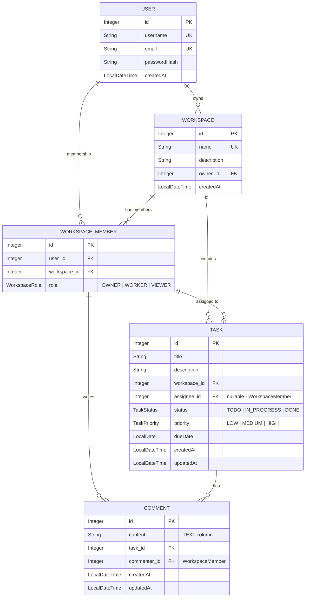
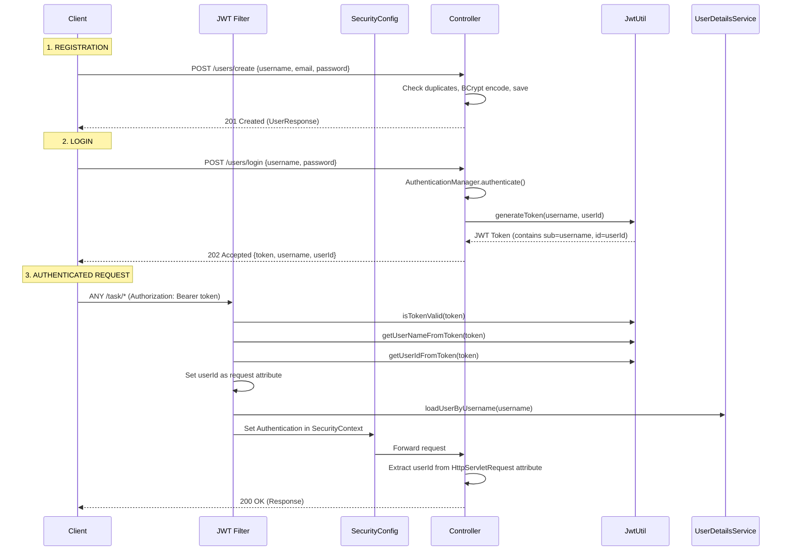

# 🎯 Task Collab — Interview Preparation Guide

> **Use this document to prepare for your interview. It covers everything about your backend project — how to explain it, the architecture decisions you made, and 50+ questions interviewers commonly ask with strong answers.**

---

## 📌 1. Project Introduction (How to Explain It)

### One-liner

> "Task Collab is a **real-time collaborative task management backend** built with Spring Boot 4.1 and Java 21, where users can create workspaces, invite team members with role-based access (OWNER, WORKER, VIEWER), manage tasks with priorities and statuses, and collaborate through comments — all secured with JWT authentication and featuring real-time WebSocket notifications."

### 2-Minute Elevator Pitch

> "I built Task Collab as a backend REST API for team-based task management, similar to tools like Trello or Jira. The core idea is that users can **register and log in** using JWT-based authentication. Once authenticated, they can **create workspaces** — think of them as project containers. Inside each workspace, users can **invite other members** and assign them roles like OWNER, WORKER, or VIEWER, enforcing role-based access control.
>
> Within a workspace, the OWNER can **create tasks** with priorities (LOW, MEDIUM, HIGH) and track their status through a lifecycle (TODO → IN_PROGRESS → DONE). Tasks can be **assigned to WORKER members**, and only the assigned worker can change the task status. Users can also **add comments** on tasks for collaboration — the task assignee and workspace owner can comment.
>
> I used **Spring Security with JWT** for stateless authentication, where the JWT token carries both the username and userId as a custom claim. **Spring Data JPA with PostgreSQL** handles persistence, and I integrated **WebSocket (STOMP over SockJS)** for real-time notifications when comments are added, edited, or deleted. The database runs in a **Docker container** for easy setup. The project follows a clean **layered architecture** with DTOs (Java Records), Mappers, and a global exception handler using `@RestControllerAdvice`."

---

## 🏗️ 2. Architecture & Tech Stack

### Tech Stack Table

| Layer                     | Technology                               | Version |
| ------------------------- | ---------------------------------------- | ------- |
| **Framework**             | Spring Boot                              | 4.1.0   |
| **Language**              | Java                                     | 21      |
| **Security**              | Spring Security + JWT (jjwt 0.13.0)      | —       |
| **Database**              | PostgreSQL                               | 17      |
| **ORM**                   | Spring Data JPA / Hibernate              | —       |
| **Real-Time**             | WebSocket (STOMP + SockJS)               | —       |
| **Validation**            | Spring Boot Starter Validation (Jakarta) | —       |
| **Build Tool**            | Maven                                    | —       |
| **Containerization**      | Docker Compose                           | —       |
| **Boilerplate Reduction** | Lombok                                   | —       |

### Layered Architecture

```
┌─────────────────────────────────────────────────────────┐
│                   CLIENT (Postman / Frontend)            │
└──────────────────────┬──────────────────────────────────┘
                       │  HTTP / WebSocket
┌──────────────────────▼──────────────────────────────────┐
│               CONTROLLER LAYER (REST APIs)               │
│   UserController, TaskController, CommentController,     │
│   WorkspaceController                                    │
├──────────────────────┬──────────────────────────────────┤
│               SERVICE LAYER (Business Logic)             │
│   UserService, TaskService, CommentService,              │
│   WorkspaceService                                       │
├──────────────────────┬──────────────────────────────────┤
│            MAPPER LAYER (DTO ↔ Entity Conversion)        │
│   UserMapper, TaskMapper, CommentMapper,                 │
│   WorkspaceMapper                                        │
├──────────────────────┬──────────────────────────────────┤
│            REPOSITORY LAYER (Data Access)                 │
│   UserRepository, TaskRepository, CommentRepository,     │
│   WorkspaceRepository, WorkspaceMemberRepository         │
├──────────────────────┬──────────────────────────────────┤
│           DATABASE (PostgreSQL 17 via Docker)             │
└──────────────────────────────────────────────────────────┘

   CROSS-CUTTING CONCERNS:
   ├── Security (JwtService filter → SecurityConfig)
   ├── Exception Handling (GlobalExceptionHandling - @RestControllerAdvice)
   └── WebSocket (Real-time comment notifications via SimpMessagingTemplate)
```

### Package Structure

```
com.project.task_collap
├── TaskCollapApplication.java       # Main Spring Boot entry point
├── config/
│   ├── OpenApiConfig.java           # OpenAPI 3 / Swagger configuration with Bearer JWT
│   ├── SecurityConfig.java          # Spring Security filter chain, CORS, BCrypt
│   ├── WebSocketConfig.java         # STOMP WebSocket (/ws endpoint, /live broker)
│   └── jwt/
│       ├── JwtService.java          # JWT authentication filter (OncePerRequestFilter)
│       ├── JwtUtil.java             # JWT token generation (with userId claim) & validation
│       ├── MyUserDetailService.java # Custom UserDetailsService (finds by username)
│       └── UserPrincipal.java       # Custom UserDetails wrapping User entity
├── exception/
│   └── GlobalExceptionHandling.java # @RestControllerAdvice: validation, status, generic errors
├── user/
│   ├── User.java                    # Entity: id, username, email, passwordHash, createdAt
│   ├── UserController.java          # /users/create, /users/login, /users/me, /users/search
│   ├── UserService.java             # Registration (duplicate check), login, search
│   ├── UserRepository.java          # findByUsername, existsByUsername, existsByEmail, search
│   ├── dtos/                        # LoginRequest, LoginResponse, UserRequest, UserResponse (records)
│   └── mapper/UserMapper.java       # User → UserResponse conversion
├── workspace/
│   ├── Workspace.java               # Entity: id, name, description, owner (ManyToOne User)
│   ├── WorkspaceMember.java         # Join entity: id, user, workspace, role (unique constraint)
│   ├── WorkspaceRole.java           # Enum: OWNER, WORKER, VIEWER
│   ├── WorkspaceController.java     # /workspace/create, /owned, /delete, member CRUD, role update
│   ├── WorkspaceService.java        # Workspace CRUD, member management, role update logic
│   ├── WorkspaceRepository.java     # findByOwner
│   ├── WorkspaceMemberRepository.java # findByUserAndWorkspace, existsBy, deleteAllByWorkspace
│   ├── dtos/                        # Request/Response DTOs (records)
│   └── mapper/WorkspaceMapper.java  # Workspace/Member ↔ DTO conversions
├── task/
│   ├── Task.java                    # Entity: id, title, description, workspace, assignee (WorkspaceMember),
│   │                                #   status, priority, dueDate, createdAt, updatedAt
│   ├── TaskPriority.java            # Enum: LOW, MEDIUM, HIGH
│   ├── TaskStatus.java              # Enum: TODO, IN_PROGRESS, DONE
│   ├── TaskController.java          # /task/create, /all/{wsId}, /assign, /status, /update, /delete
│   ├── TaskService.java             # Task CRUD, assign, status change, due date — owner-gated
│   ├── TaskRepository.java          # findAllTasksByWorkspace, findAllTasksByAssignee
│   ├── dto/                         # TaskRequest, TaskResponse, TaskUpdateRequest (records)
│   └── TaskMapper.java              # Task → TaskResponse (includes workspace & assignee DTOs)
└── comment/
    ├── Comment.java                 # Entity: id, content (TEXT), task, commenter (WorkspaceMember)
    ├── CommentController.java       # /comments/add, /task/{taskId}, /edit/{id}, /delete/{id}
    ├── CommentService.java          # Add/edit/delete with WebSocket broadcasting
    ├── CommentRepository.java       # findAllByTaskOrderByCreatedAtAsc
    ├── dto/                         # CommentRequest, CommentResponse (records)
    └── CommentMapper.java           # Comment → CommentResponse conversion
```

---

## 🗄️ 3. Database Design (Entity Relationships)

### ER Diagram



### Key Relationships Explained

| Relationship                           | Type         | Explanation                                              |
| -------------------------------------- | ------------ | -------------------------------------------------------- |
| User → Workspace                       | One-to-Many  | A user can own multiple workspaces                       |
| User ↔ Workspace (via WorkspaceMember) | Many-to-Many | Users can be members of multiple workspaces with roles   |
| Workspace → Task                       | One-to-Many  | A workspace contains multiple tasks                      |
| WorkspaceMember → Task                 | One-to-Many  | A workspace member (not User directly) is assigned tasks |
| Task → Comment                         | One-to-Many  | A task can have multiple comments                        |
| WorkspaceMember → Comment              | One-to-Many  | A workspace member (not User directly) writes comments   |

> [!IMPORTANT]
> **Tasks and Comments reference `WorkspaceMember`, not `User` directly.** This is a key design decision — it means assignees and commenters are always scoped to a workspace context, ensuring workspace-level authorization.

---

## 🔐 4. Security Architecture (JWT Authentication)

### Authentication Flow



### How JWT Works in This Project (Step by Step)

1. **JwtUtil** — Utility class (`@Component`) that:
   - Generates JWT tokens signed with **HMAC-SHA** using a secret key from `${jwt_key}` env variable
   - Embeds **two claims**: `subject` (username) and a custom claim `id` (userId)
   - Sets token expiration to **1 hour** (`System.currentTimeMillis() + 1000 * 60 * 60`)
   - Validates tokens by parsing claims — if parsing succeeds, the token is valid; any exception = invalid
   - Extracts username (`getSubject()`) and userId (`get("id", Integer.class)`) from claims

2. **JwtService** — A `OncePerRequestFilter` that:
   - Checks for `Authorization: Bearer <token>` header
   - If valid, extracts username AND userId from the token
   - **Sets `userId` as an HttpServletRequest attribute** — this is how controllers get the current user's ID
   - Loads UserDetails from DB and sets Authentication in SecurityContext

3. **SecurityConfig** — Configures:
   - CSRF disabled (stateless REST API)
   - Session management: `STATELESS`
   - Public endpoints: `/users/create`, `/users/login`, `/users/search`, `/ws/**`
   - All other endpoints: authenticated
   - JWT filter added **before** `UsernamePasswordAuthenticationFilter`
   - CORS configured for `http://localhost:8084`
   - `DaoAuthenticationProvider` with `BCryptPasswordEncoder`

4. **MyUserDetailService** — Custom `UserDetailsService` that finds users **by username** (not email)

5. **UserPrincipal** — Custom `UserDetails` wrapping the `User` entity, exposing `getId()`, `getUsername()`, and `ROLE_USER` authority

### How the Current User is Identified in Controllers

> [!TIP]
> Controllers inject the authenticated user directly using Spring Security's `@AuthenticationPrincipal UserPrincipal currentUser`:
>
> ```java
> Integer userId = currentUser.getId();
> ```
>
> In the `JwtService` filter, the token is validated, `loadUserByUsername` loads the `UserPrincipal`, and sets it as the principal inside `UsernamePasswordAuthenticationToken` in `SecurityContextHolder`. This is the clean, idiomatic Spring Security way to access user identity.

---

## 🔌 5. API Endpoints (Actual Paths)

### User / Authentication APIs

| Method | Endpoint               | Access        | Description                                             |
| ------ | ---------------------- | ------------- | ------------------------------------------------------- |
| `POST` | `/users/create`        | Public        | Register a new user (checks duplicate username & email) |
| `POST` | `/users/login`         | Public        | Login → returns JWT token, username, userId             |
| `GET`  | `/users/me`            | Authenticated | Get current logged-in user's details                    |
| `GET`  | `/users/search?query=` | Public        | Search users by username or email (case-insensitive)    |

### Workspace APIs

| Method   | Endpoint                                        | Access                | Description                                                       |
| -------- | ----------------------------------------------- | --------------------- | ----------------------------------------------------------------- |
| `POST`   | `/workspace/create`                             | Authenticated         | Create workspace (caller becomes OWNER member)                    |
| `GET`    | `/workspace/owned`                              | Authenticated         | Get all workspaces owned by current user                          |
| `DELETE` | `/workspace/delete?workspaceId=`                | Authenticated (OWNER) | Delete workspace + all its members                                |
| `POST`   | `/workspace/member/add`                         | Authenticated (OWNER) | Add a member with a role (can't assign OWNER)                     |
| `GET`    | `/workspace/member/all?workspaceId=`            | Authenticated         | Get all members of a workspace                                    |
| `DELETE` | `/workspace/member/delete?memberId=`            | Authenticated (OWNER) | Remove a member (can't remove OWNER)                              |
| `PUT`    | `/workspace/member/update-role?memberId=&role=` | Authenticated (OWNER) | Change a member's role (can't set to OWNER or change own role)    |
| `GET`    | `/workspace/member/myWorkspaces`                | Authenticated         | Get all workspaces the user is a member of (with memberId & role) |

### Task APIs

| Method   | Endpoint                                     | Access                             | Description                                   |
| -------- | -------------------------------------------- | ---------------------------------- | --------------------------------------------- |
| `POST`   | `/task/create`                               | Authenticated (workspace OWNER)    | Create a task (can assign to a WORKER member) |
| `GET`    | `/task/all/{workspaceId}`                    | Authenticated (workspace member)   | Get all tasks in a workspace                  |
| `GET`    | `/task/page/{workspaceId}`                   | Authenticated (workspace member)   | Paginated tasks with sorting (`page, size, sortBy, direction`) |
| `GET`    | `/task/all?memberId=`                        | Authenticated (own memberId only)  | Get all tasks assigned to a specific member   |
| `PUT`    | `/task/assign?taskId=&assigneeId=`           | Authenticated (workspace OWNER)    | Assign a task to a WORKER member              |
| `PUT`    | `/task/set-due-date?taskId=&date=dd-MM-yyyy` | Authenticated (workspace OWNER)    | Set/update due date on a task                 |
| `PUT`    | `/task/status?taskId=&status=`               | Authenticated (task assignee only) | Change task status (TODO/IN_PROGRESS/DONE)    |
| `PATCH`  | `/task/update?taskId=`                       | Authenticated (workspace OWNER)    | Update task name, description, priority       |
| `DELETE` | `/task/delete?taskId=`                       | Authenticated (workspace OWNER)    | Delete a task                                 |

### Comment APIs

| Method   | Endpoint                       | Access                                           | Description                                           |
| -------- | ------------------------------ | ------------------------------------------------ | ----------------------------------------------------- |
| `POST`   | `/comments/add`                | Authenticated (task assignee or workspace OWNER) | Add a comment to a task + WebSocket broadcast         |
| `GET`    | `/comments/task/{taskId}`      | Authenticated (workspace member)                 | Get all comments on a task (ordered by createdAt ASC) |
| `PATCH`  | `/comments/edit/{commentId}`   | Authenticated (original commenter only)          | Edit a comment + WebSocket broadcast                  |
| `DELETE` | `/comments/delete/{commentId}` | Authenticated (commenter or workspace OWNER)     | Delete a comment + WebSocket broadcast                |

### WebSocket Endpoints

| Protocol     | Endpoint                              | Description                                          |
| ------------ | ------------------------------------- | ---------------------------------------------------- |
| STOMP/SockJS | `/ws`                                 | WebSocket connection endpoint (allowed origins: `*`) |
| Subscribe    | `/live/task/{taskId}/comments`        | New comment notifications for a task                 |
| Subscribe    | `/live/task/{taskId}/comments/update` | Comment edit notifications                           |
| Subscribe    | `/live/task/{taskId}/comments/delete` | Comment delete notifications (receives commentId)    |

---

## 🛡️ 6. Role-Based Access Control (RBAC)

### Workspace Roles

| Role       | Description                                                                   |
| ---------- | ----------------------------------------------------------------------------- |
| **OWNER**  | The workspace creator. Full control over everything.                          |
| **WORKER** | Can be assigned tasks, can change task status, can comment on assigned tasks. |
| **VIEWER** | Can view workspace, tasks, and comments. Cannot be assigned tasks.            |

### Permissions Matrix

| Action                           | OWNER                | WORKER                   | VIEWER |
| -------------------------------- | -------------------- | ------------------------ | ------ |
| View workspace tasks             | ✅                   | ✅                       | ✅     |
| View comments                    | ✅                   | ✅                       | ✅     |
| Create task                      | ✅                   | ❌                       | ❌     |
| Assign task to member            | ✅                   | ❌                       | ❌     |
| Set due date                     | ✅                   | ❌                       | ❌     |
| Update task (name/desc/priority) | ✅                   | ❌                       | ❌     |
| Delete task                      | ✅                   | ❌                       | ❌     |
| Change task status               | ❌ (unless assigned) | ✅ (only assigned tasks) | ❌     |
| Add comment                      | ✅                   | ✅ (on assigned task)    | ❌     |
| Edit comment                     | ✅ (own only)        | ✅ (own only)            | ❌     |
| Delete comment                   | ✅ (any comment)     | ✅ (own only)            | ❌     |
| Add members                      | ✅                   | ❌                       | ❌     |
| Remove members                   | ✅                   | ❌                       | ❌     |
| Change member roles              | ✅                   | ❌                       | ❌     |
| Delete workspace                 | ✅                   | ❌                       | ❌     |

### How RBAC is Implemented

- The `WorkspaceMember` entity links a `User` to a `Workspace` with a `WorkspaceRole` enum
- It has a **unique constraint** on `(user_id, workspace_id)` — a user can only be a member once per workspace
- When a user creates a workspace, they are automatically added as an **OWNER** member
- Authorization checks are done **at the service layer**:
  - Most task operations check `workspace.getOwner().getId().equals(ownerId)` — only the workspace owner can create/update/delete/assign tasks
  - Status change checks `task.getAssignee().getUser().getId().equals(userId)` — only the assignee can change status
  - Comments check if the user is the task assignee or workspace owner
- VIEWERs **cannot be assigned tasks** (checked during task creation and assignment)
- The OWNER role **cannot be assigned** to other members or changed

---

## ⚡ 7. WebSocket (Real-Time Notifications)

### How It Works

- Uses **STOMP protocol** over **SockJS** for cross-browser compatibility
- Configured with message broker prefix **`/live`** (not `/topic`) and application destination prefix `/app`
- `SimpMessagingTemplate` is injected into **CommentService** (not TaskService) for broadcasting
- Three types of real-time notifications are sent:

| Event             | Destination                           | Payload                   |
| ----------------- | ------------------------------------- | ------------------------- |
| New comment added | `/live/task/{taskId}/comments`        | `CommentResponse` object  |
| Comment edited    | `/live/task/{taskId}/comments/update` | Updated `CommentResponse` |
| Comment deleted   | `/live/task/{taskId}/comments/delete` | `commentId` (Integer)     |

### Example Flow

```
1. User A adds a comment on Task #10
2. CommentService saves the comment to DB
3. CommentService sends CommentResponse → /live/task/10/comments
4. User B (subscribed to /live/task/10/comments) receives the new comment instantly
5. If User A edits the comment → notification sent to /live/task/10/comments/update
6. If User A deletes the comment → commentId sent to /live/task/10/comments/delete
```

---

## 🧱 8. Design Patterns & Best Practices Used

| Pattern/Practice                            | Where Used                                                                                | Why                                                                                 |
| ------------------------------------------- | ----------------------------------------------------------------------------------------- | ----------------------------------------------------------------------------------- |
| **DTO Pattern (Java Records)**              | All modules use `record` types for DTOs                                                   | Immutable, concise, automatic equals/hashCode/toString; decouples API from entities |
| **Mapper Pattern** (static utility classes) | UserMapper, TaskMapper, CommentMapper, WorkspaceMapper                                    | Centralized entity ↔ DTO conversion; private constructor prevents instantiation     |
| **Repository Pattern**                      | All JPA repositories extending `JpaRepository`                                            | Abstract data access; Spring Data JPA auto-generates implementations                |
| **Filter Chain Pattern**                    | JwtService (`OncePerRequestFilter`)                                                       | Intercept HTTP requests for JWT validation before controllers                       |
| **Layered Architecture**                    | Controller → Service → Mapper → Repository                                                | Separation of concerns, each layer has a single responsibility                      |
| **Global Exception Handling**               | `@RestControllerAdvice` with `@ExceptionHandler`                                          | Centralized error handling: validation errors, status exceptions, generic errors    |
| **Externalized Configuration**              | `.env` file + `${jwt-key}` / `${db-password}` in properties                               | Secrets not hardcoded; keeps credentials out of source code                         |
| **Stateless Authentication**                | JWT + `SessionCreationPolicy.STATELESS`                                                   | No server-side session state; scalable                                              |
| **Docker for Infrastructure**               | `docker-compose.yml` for PostgreSQL 17                                                    | One-command database setup with persistent volume                                   |
| **Unique Constraints**                      | `WorkspaceMember(user_id, workspace_id)`, `User.username`, `User.email`, `Workspace.name` | Database-level data integrity                                                       |
| **Derived Query Methods**                   | `findByUsername`, `findAllTasksByWorkspace`, `findAllByTaskOrderByCreatedAtAsc`           | Spring Data JPA generates SQL from method names                                     |
| **Request Attribute Pattern**               | `httpServlet.getAttribute("userId")`                                                      | Pass userId from JWT filter to controllers without coupling to SecurityContext      |
| **Pub-Sub Pattern**                         | WebSocket STOMP topics for comment notifications                                          | Decoupled real-time updates; clients subscribe to topics                            |

---

## 🔥 9. Key Features Summary

1. **User Registration & Login** — BCrypt password hashing, duplicate username/email checks, JWT token with userId claim
2. **User Search** — Case-insensitive search by username or email
3. **Workspace Management** — Create, view owned workspaces, delete (with cascade through members)
4. **Member Management** — Add members with roles, remove members, update roles (can't modify OWNER)
5. **My Workspaces View** — See all workspaces you're a member of with your role and memberId
6. **Task Management** — Full CRUD by workspace owner; priority (LOW/MEDIUM/HIGH) and status (TODO/IN_PROGRESS/DONE)
7. **Task Assignment** — Assign tasks to WORKER members (VIEWERs cannot be assigned)
8. **Status Workflow** — Only the assigned worker can change task status
9. **Due Date Management** — Workspace owner can set/update due dates (format: dd-MM-yyyy)
10. **Commenting System** — Add, edit, delete comments; only task assignee or workspace owner can comment
11. **Real-Time Updates** — WebSocket (STOMP/SockJS) broadcasts for comment add/edit/delete events
12. **Global Exception Handling** — Consistent error responses: validation errors → field map, ResponseStatusException → status+reason, generic → 500
13. **Input Validation** — Jakarta Validation (`@NotBlank`, `@Email`, `@NotNull`) with `@Valid` on controllers
14. **Dockerized Database** — PostgreSQL 17 running in Docker with named volume for persistence

---

## ❓ 10. Interview Questions & Answers

### 🟢 SECTION A: Project Overview Questions

---

**Q1: Can you tell me about this project?**

> "Task Collab is a collaborative task management backend REST API I built using Spring Boot 4.1 and Java 21. It allows users to register, create workspaces, invite team members with role-based access control — OWNER, WORKER, and VIEWER — manage tasks with priorities and statuses, and collaborate through comments. I implemented JWT-based stateless authentication where the token carries both the username and userId as claims. For real-time features, I used WebSocket with STOMP over SockJS to broadcast comment events. The data is stored in PostgreSQL running in Docker, and the project follows a clean layered architecture with Java Record DTOs, static Mapper utility classes, and a global exception handler."

---

**Q2: Why did you build this project?**

> "I wanted to build a project that demonstrates real-world backend skills — authentication, authorization, REST API design, complex database relationships, and real-time communication. A task management tool was a perfect fit because it involves complex entity relationships — users, workspaces, members with roles, tasks with assignments, and comments — plus role-based access control and real-time features. These are the exact challenges you encounter in production applications."

---

**Q3: What problem does this project solve?**

> "It solves the problem of team collaboration on tasks. Teams need a centralized platform to organize work, assign responsibilities with clear roles, track progress through status changes, and communicate on tasks — all in real time. This backend provides the APIs that a frontend like Trello or Asana would consume."

---

**Q4: What was the most challenging part of this project?**

> "Two things were particularly challenging:
>
> First, **the authorization model**. Unlike simple app-level roles, my roles are **scoped per workspace** — the same user can be an OWNER in one workspace and a VIEWER in another. I had to design the `WorkspaceMember` join table with a role column and a unique constraint on `(user_id, workspace_id)`, then write different authorization checks depending on the operation — for example, only the workspace OWNER can create tasks, but only the task ASSIGNEE can change the status.
>
> Second, **integrating WebSocket with Spring Security**. I needed the `/ws` endpoint to be accessible without a JWT token (since WebSocket handshake is HTTP), while all REST endpoints required authentication. I also had to make sure comment events were broadcast to the right task-specific topics."

---

**Q5: Walk me through a typical user flow.**

> "1. A user **registers** at `/users/create` with username, email, and password. The password is BCrypt-hashed before storage. 2. They **log in** at `/users/login` — Spring Security's `AuthenticationManager` validates credentials, and a JWT token is generated with the username and userId. 3. They **create a workspace** at `/workspace/create` — they're automatically added as an OWNER member. 4. They **search for other users** at `/users/search` and **add them as members** at `/workspace/member/add` with WORKER or VIEWER roles. 5. The OWNER **creates tasks** at `/task/create`, setting priority and status, optionally assigning to a WORKER member. 6. The assigned WORKER **changes task status** from TODO → IN_PROGRESS → DONE via `/task/status`. 7. The assignee or OWNER **adds comments** at `/comments/add` — these are **broadcast in real time** via WebSocket to anyone subscribed to `/live/task/{taskId}/comments`."

---

### 🟡 SECTION B: Technical Architecture Questions

---

**Q6: Explain your project architecture.**

> "I followed a **layered architecture** with four main layers:
>
> - **Controller Layer** — Handles HTTP requests and response codes. Extracts the userId from the HttpServletRequest attribute (set by the JWT filter), passes it to services, and returns `ResponseEntity` objects.
> - **Service Layer** — Contains all business logic and authorization checks. Queries repositories to validate permissions before performing operations.
> - **Mapper Layer** — Static utility classes with private constructors that convert between entities and DTOs in both directions. They keep transformation logic out of the service layer.
> - **Repository Layer** — Spring Data JPA interfaces that extend `JpaRepository`. I used derived query methods for most queries.
>
> Cross-cutting concerns are handled by the JWT filter (authentication), `@RestControllerAdvice` (exception handling), and WebSocket config (real-time messaging).
>
> Each domain module (user, workspace, task, comment) is organized in its own package with all its related classes."

---

**Q7: Why did you use DTOs instead of returning entities directly?**

> "Several important reasons:
>
> 1. **Security** — My User entity has a `passwordHash` field that should never be exposed in API responses
> 2. **Decoupling** — The API contract is independent of the database schema. If I rename an entity field, the API response structure doesn't change
> 3. **Control** — DTOs let me return exactly the data the client needs. For example, my `TaskResponse` includes flattened workspace and assignee details instead of nested entity graphs
> 4. **Avoiding lazy loading issues** — Returning entities with lazy-loaded relationships from a controller can cause `LazyInitializationException` if the transaction is closed
> 5. **Validation separation** — Request DTOs carry validation annotations separate from entity constraints"

---

**Q8: Why did you use Java Records for DTOs?**

> "Java Records are perfect for DTOs because they are:
>
> - **Immutable** — once created, their fields can't be changed, which is exactly what you want for request/response objects
> - **Concise** — a record auto-generates the constructor, getters, `equals()`, `hashCode()`, and `toString()` — no Lombok needed for DTOs
> - **Semantic** — using `record` clearly communicates 'this is a data carrier, not a mutable entity'
>
> For entities I still use regular classes with Lombok `@Data` because entities need setters for JPA."

---

**Q9: Why did you use static Mapper classes instead of instance methods or MapStruct?**

> "My mappers are simple field-to-field conversions, so static utility classes with private constructors keep things lightweight. I didn't need MapStruct's code generation because my mappings are straightforward. The private constructor prevents accidental instantiation, following the utility class pattern. If the mappings grew more complex — like requiring injected dependencies or conditional logic — I'd switch to Spring beans or MapStruct."

---

**Q10: Why PostgreSQL and not MySQL?**

> "PostgreSQL offers better support for advanced data types, JSONB columns (useful for future extensions like task metadata), better concurrency control with MVCC, and has a stronger standards compliance. It's also the default choice for many cloud platforms like Heroku and AWS RDS. For this project, both would work fine — it was more of a preference for the ecosystem."

---

**Q11: Why Docker for the database?**

> "Docker provides a **reproducible and portable** setup. Anyone can clone my repo and run `docker-compose up` to have PostgreSQL 17 running instantly — no manual installation, no version conflicts. My docker-compose file defines:
>
> - Exact PostgreSQL version (17)
> - Port mapping (host `1234` → container `5432`)
> - Credentials via environment variables
> - **Named volume** (`task_db_data`) for data persistence across container restarts
> - A dedicated Docker network (`task_network`)."

---

### 🔴 SECTION C: Security Questions (Important!)

---

**Q12: How does JWT authentication work in your project?**

> "When a user logs in with valid credentials, the `AuthenticationManager` validates them using the `DaoAuthenticationProvider` + `BCryptPasswordEncoder`. On success, `JwtUtil.generateToken()` creates a JWT signed with HMAC-SHA using a secret key from environment variables. The token contains **two claims**: the username as the subject and the userId as a custom claim, with a 1-hour expiry.
>
> For every subsequent request, the `JwtService` filter intercepts it, checks for the `Authorization: Bearer <token>` header, parses the token to validate it (if parsing succeeds without exceptions, it's valid), extracts the username and userId, sets the userId as a **request attribute** on `HttpServletRequest`, loads the `UserDetails` from the database, and sets the `Authentication` in Spring Security's `SecurityContext`. The controller then reads the userId from the request attribute."

---

**Q13: Why did you store userId in the JWT token as a custom claim?**

> "Storing the userId in the token avoids an extra database query on every request just to look up the user's ID from their username. The JWT filter extracts it and sets it as a request attribute, so controllers can immediately use it. This is a performance optimization — instead of calling `userRepository.findByUsername()` in every controller method, the ID is already available from the token."

---

**Q14: Why JWT and not session-based authentication?**

> "JWT provides **stateless authentication** — the server doesn't store any session data. Benefits:
>
> - **Scalable** — any server instance can validate the token independently, no shared session store needed
> - **Mobile/SPA friendly** — tokens work natively with mobile apps and single-page applications
> - **Microservice friendly** — tokens can be passed between services for inter-service authentication
> - Session-based auth would require sticky sessions or a session store like Redis, adding infrastructure complexity."

---

**Q15: How did you handle password security?**

> "I used `BCryptPasswordEncoder` from Spring Security. BCrypt:
>
> - Is a **one-way hashing** algorithm — you can't reverse the hash to get the password
> - Has **built-in salt** — each hash is unique even for identical passwords, preventing rainbow table attacks
> - Has a **cost factor** that makes brute-force expensive
>
> During registration, `passwordEncoder.encode(password)` hashes the password. During login, `AuthenticationManager.authenticate()` internally uses the password encoder to compare the raw password with the stored hash."

---

**Q16: Where do you store the JWT secret key?**

> "In an `.env` file with the key `jwt-key`. It's referenced in `application.properties` as `jwt_key=${jwt-key}`. The `.env` file should be in `.gitignore` so it's never committed. In production, I would use environment variables set by the deployment platform or a secrets manager like AWS Secrets Manager or HashiCorp Vault."

---

**Q17: What happens when a JWT token expires?**

> "When a token expires (after 1 hour), `JwtUtil.isTokenValid()` catches the `ExpiredJwtException` during claims parsing and returns `false`. The `JwtService` filter then doesn't set the Authentication, so Spring Security rejects the request with **401 Unauthorized**. The client must log in again to get a new token.
>
> Currently I don't have refresh tokens, but in production I'd implement a **refresh token mechanism** — a long-lived token stored in the database that can issue new access tokens without re-entering credentials."

---

**Q18: How did you handle CORS?**

> "In `SecurityConfig`, I configured a `CorsConfigurationSource` bean that allows requests from `http://localhost:8084` (my frontend dev server). I allowed all methods (`*`), all headers (`*`), and enabled credentials. In production, I'd restrict the allowed origins to the actual frontend domain."

---

**Q19: Your `isTokenValid()` catches all exceptions — isn't that bad practice?**

> "Catching a generic `Exception` is generally discouraged, but in this specific case, the JJWT library can throw several different exceptions — `ExpiredJwtException`, `MalformedJwtException`, `SignatureException`, `UnsupportedJwtException`, etc. All of them mean the same thing: the token is invalid. So catching the base `Exception` is a pragmatic choice to return `false` for any kind of invalid token. The alternative would be catching each specific exception type, but the handling would be identical for all of them."

---

### 🟠 SECTION D: Database & JPA Questions

---

**Q20: Explain the entity relationships in your project.**

> "There are 5 entities:
>
> - **User** — has `id`, `username` (unique), `email` (unique), `passwordHash`, and `createdAt`. It's the identity entity.
> - **Workspace** — has `name` (unique) and `description`, and a `@ManyToOne` relationship to `User` (the owner).
> - **WorkspaceMember** — the **join entity** linking User and Workspace with a `WorkspaceRole` enum. It has a `@UniqueConstraint` on `(user_id, workspace_id)` to prevent duplicate memberships.
> - **Task** — belongs to a Workspace, optionally assigned to a `WorkspaceMember` (not User directly), has `status` and `priority` enums, `dueDate`, and audit timestamps.
> - **Comment** — belongs to a Task, written by a `WorkspaceMember` (not User directly), has `content` stored as `TEXT` column type, and audit timestamps."

---

**Q21: Why did you use WorkspaceMember instead of `@ManyToMany`?**

> "Because my many-to-many relationship between User and Workspace has **extra attributes** — the `role` (OWNER, WORKER, VIEWER). A plain `@ManyToMany` only creates a join table with two foreign keys and no room for extra columns. By creating a dedicated `WorkspaceMember` entity, I can:
>
> - Add the `role` column with `@Enumerated(EnumType.STRING)`
> - Add a `@UniqueConstraint` on the combination of user and workspace
> - Query it directly through `WorkspaceMemberRepository` (e.g., `findByUserAndWorkspace`, `existsByUserAndWorkspace`)
> - Use it as a foreign key in other entities (Task's assignee, Comment's commenter)
>
> This is the recommended pattern in JPA for many-to-many relationships with attributes."

---

**Q22: Why do Tasks and Comments reference WorkspaceMember instead of User?**

> "This is intentional. A `WorkspaceMember` represents a user **within the context of a specific workspace**. By referencing `WorkspaceMember`:
>
> - The task assignee is automatically scoped to the workspace — you can't assign a task to someone who isn't a member
> - Comments are attributed to the user's workspace membership, making it easy to check their role
> - If a member is removed from a workspace, their relationship to tasks/comments in that workspace is clear
>
> If I referenced User directly, I'd need additional checks everywhere to verify the user is actually a member of the workspace that owns the task."

---

**Q23: What is `ddl-auto=update`? Would you use it in production?**

> "`spring.jpa.hibernate.ddl-auto=update` tells Hibernate to automatically update the database schema to match the entity classes — adding new columns or tables without dropping existing data. **No, I would NOT use it in production** because:
>
> - It can't handle all schema changes (e.g., renaming columns, dropping columns)
> - It doesn't track what changes were applied
> - It's not reversible
>
> In production, I'd use **Flyway or Liquibase** for versioned, repeatable, auditable database migrations."

---

**Q24: What fetch types did you use?**

> "I explicitly set `FetchType.LAZY` on all `@ManyToOne` relationships in my Task, Comment, Workspace, and WorkspaceMember entities. This means related entities are only fetched from the database when they are actually accessed, not when the parent entity is loaded. This prevents loading the entire object graph for every query. For example, loading a comment doesn't automatically load the task, workspace, and commenter unless I access those properties."

---

**Q25: How did you handle cascading deletes?**

> "I handle deletion **programmatically in the service layer** rather than using JPA cascade annotations:
>
> - `WorkspaceService.deleteMyWorkspace()` first calls `workspaceMemberRepository.deleteAllByWorkspace(workspace)` to delete all members, then `workspaceRepository.deleteById(workspaceId)` to delete the workspace. This is wrapped in `@Transactional`.
> - For tasks, the `TaskService.deleteTask()` deletes the task directly.
>
> I chose programmatic deletion over `CascadeType.REMOVE` because it gives me full control over the deletion order, lets me add authorization checks, and makes the deletion behavior explicit rather than hidden in annotations."

---

**Q26: What custom repository methods did you write?**

> "I used Spring Data JPA's **derived query methods**:
>
> - `UserRepository`:
>   - `findByUsername(String)` — for authentication
>   - `existsByUsername(String)` and `existsByEmail(String)` — for duplicate checks during registration
>   - `findByUsernameContainingIgnoreCaseOrEmailContainingIgnoreCase(String, String)` — for user search
> - `WorkspaceMemberRepository`:
>   - `findByUserAndWorkspace(User, Workspace)` — check membership and get role
>   - `existsByUserAndWorkspace(User, Workspace)` — quick membership check
>   - `deleteAllByWorkspace(Workspace)` — cascade delete with `@Modifying` + `@Transactional`
>   - `findAllByWorkspace(Workspace)` — list all members
>   - `findAllWorkspaceMembersByUser(User)` — get all workspace memberships for a user
> - `TaskRepository`:
>   - `findAllTasksByWorkspace(Workspace)` — tasks in a workspace
>   - `findAllTasksByAssignee(WorkspaceMember)` — tasks assigned to a member
> - `CommentRepository`:
>   - `findAllByTaskOrderByCreatedAtAsc(Task)` — comments ordered chronologically"

---

### 🔵 SECTION E: Spring Boot & Spring Security Questions

---

**Q27: What is `OncePerRequestFilter` and why did you extend it?**

> "`OncePerRequestFilter` is a Spring filter that guarantees it runs exactly **once per request**, even if the request is internally forwarded (e.g., to an error handler). I extended it for my `JwtService` filter because JWT validation should happen once — if the filter ran multiple times on the same request, it would redundantly parse the token and set the SecurityContext."

---

**Q28: How does your Security Filter Chain work?**

> "In `SecurityConfig.securityFilterChain()`:
>
> 1. **Disable CSRF** — stateless REST API doesn't use cookies, so CSRF protection is unnecessary
> 2. **Enable CORS** — configured for `http://localhost:8084`
> 3. **Session management** → `STATELESS` — no `JSESSIONID` cookie, no server-side session
> 4. **URL authorization** — `/users/create`, `/users/login`, `/users/search`, `/ws/**` are `permitAll()`, everything else requires authentication
> 5. **Authentication provider** — `DaoAuthenticationProvider` with my custom `MyUserDetailService` and `BCryptPasswordEncoder`
> 6. **JWT filter** added **before** `UsernamePasswordAuthenticationFilter`
>
> The request flow is: CORS → JwtService → Spring Security Filters → Controller."

---

**Q29: What is `@RestControllerAdvice` and how did you use it?**

> "`@RestControllerAdvice` = `@ControllerAdvice` + `@ResponseBody`. It allows centralized exception handling across all controllers with responses automatically serialized to JSON.
>
> My `GlobalExceptionHandling` handles three types:
>
> 1. **`MethodArgumentNotValidException`** → 400 Bad Request with a `Map<String, String>` of field name → error message (for `@Valid` failures)
> 2. **`ResponseStatusException`** → Returns the specific status code and reason message (I throw these throughout my services with `HttpStatus.FORBIDDEN`, `NOT_FOUND`, `CONFLICT`, etc.)
> 3. **Generic `Exception`** → 500 Internal Server Error with the exception message
>
> This ensures every error across the API has a consistent format."

---

**Q30: How does validation work in your project?**

> "I use **Jakarta Bean Validation** annotations on my Request DTO records:
>
> - `@NotBlank` — for required strings (rejects null, empty, and whitespace-only)
> - `@NotNull` — for required non-string fields (workspaceId, status, priority, role)
> - `@Email` — for email format
>
> In controllers, I annotate request body parameters with `@Valid`. Spring automatically validates the object before the controller method runs. If validation fails, Spring throws `MethodArgumentNotValidException`, which my global exception handler catches and transforms into a user-friendly `Map<fieldName, errorMessage>` response with 400 status."

---

**Q31: Why do you use `ResponseStatusException` instead of custom exceptions?**

> "`ResponseStatusException` is convenient because it bundles the HTTP status code and a reason message in one throw. For example:
>
> ```java
> throw new ResponseStatusException(HttpStatus.FORBIDDEN, "You are not allowed to create task");
> ```
>
> This is cleaner than creating a separate exception class for every error type. My global handler catches it and returns the status code + reason. For a project of this size, it's pragmatic. In larger projects, I would define domain-specific custom exceptions (like `WorkspaceAccessDeniedException`) for better error categorization."

---

**Q32: What is `SimpMessagingTemplate`?**

> "`SimpMessagingTemplate` is Spring's abstraction for sending STOMP messages to WebSocket clients. I inject it into `CommentService` and use:
>
> ```java
> messagingTemplate.convertAndSend("/live/task/" + taskId + "/comments", commentResponse);
> ```
>
> This sends the `CommentResponse` to all clients subscribed to that topic. It acts as the **publish** side of a pub-sub system — my service publishes events, and any subscribed frontend receives them instantly."

---

### 🟣 SECTION F: Design Decision Questions

---

**Q33: Why did you use enums for TaskStatus, TaskPriority, and WorkspaceRole?**

> "Enums provide **type safety** at compile time:
>
> - No typos possible (e.g., `TOOD` instead of `TODO`)
> - IDE auto-complete and refactoring support
> - Self-documenting — all valid values are defined in one place
> - JPA stores them as strings in the DB using `@Enumerated(EnumType.STRING)`, so the database values are human-readable
> - Request validation — Spring automatically rejects invalid enum values in request bodies"

---

**Q34: How does your task lifecycle work?**

> "Tasks follow a Kanban-style lifecycle with 3 statuses:
>
> 1. **TODO** — Task is created but not started
> 2. **IN_PROGRESS** — The assigned worker is actively working on it
> 3. **DONE** — Task is completed
>
> Key rules:
>
> - The workspace **OWNER** creates tasks and sets the initial status
> - Only the **assigned WORKER** can change the task status (via `PUT /task/status`)
> - A task **must have an assignee** before its status can be changed
> - VIEWERs **cannot be assigned** tasks
> - Currently there are no restrictions on status transitions (any status can go to any other)"

---

**Q35: Why did you separate TaskRequest and TaskUpdateRequest?**

> "`TaskRequest` (for creation) requires all essential fields with `@NotBlank` and `@NotNull` — title, workspaceId, status, priority. `TaskUpdateRequest` (for updates) has only optional fields — name, description, priority — with no validation annotations. This way you can update just one field without sending everything. The service checks each field for null before applying the update, implementing a **partial update** pattern. Also, the update endpoint uses `PATCH` (not PUT), which semantically indicates a partial update."

---

**Q36: Why can only the workspace OWNER create tasks, not WORKERs?**

> "This is a deliberate access control decision. In my model, the workspace OWNER is like a **project manager** — they define the work, create tasks, assign them, set priorities and due dates. WORKERs are like **team members** — they execute assigned tasks and update statuses. VIEWERs are **stakeholders** — they can observe progress but can't modify anything. This creates a clear hierarchy of responsibilities."

---

### ⚪ SECTION G: Scenario-Based Questions

---

**Q37: What happens if someone tries to create a task in a workspace they don't own?**

> "In `TaskService.createTask()`, the first thing I do is load the workspace and check `workspace.getOwner().getId().equals(ownerId)`. If the userId from the JWT token doesn't match the workspace owner's ID, I throw:
>
> ```java
> throw new ResponseStatusException(HttpStatus.FORBIDDEN, "You are not allowed to create task in this workspace");
> ```
>
> The `GlobalExceptionHandling` catches this and returns a **403 Forbidden** response with the reason message."

---

**Q38: What if someone tries to assign a task to a VIEWER?**

> "In `TaskService.createTask()`, after resolving the assignee member, I check:
>
> ```java
> if (assignee.getRole() == WorkspaceRole.VIEWER) {
>     throw new ResponseStatusException(HttpStatus.FORBIDDEN, "Assignee was a VIEWER");
> }
> ```
>
> Similarly, `assignTask()` also checks `assignee.getRole() != WorkspaceRole.VIEWER` before allowing the assignment. This prevents VIEWERs from ever being assigned work."

---

**Q39: What if two users update the same task simultaneously?**

> "Currently, there's no optimistic or pessimistic locking — this is a **potential race condition**. The last write wins. In production, I would add **optimistic locking** by adding a `@Version` field to the Task entity:
>
> ```java
> @Version
> private Integer version;
> ```
>
> Hibernate would then automatically check the version on updates and throw `OptimisticLockingFailureException` if another transaction modified the entity, which I'd handle in the global exception handler and return a **409 Conflict** response."

---

**Q40: Can a user be in multiple workspaces with different roles?**

> "Yes! That's the whole point of the `WorkspaceMember` join entity. The same user can be an OWNER of 'Project Alpha' and a VIEWER in 'Project Beta'. The role is stored per membership, not globally. The endpoint `GET /workspace/member/myWorkspaces` returns all memberships with their respective roles and memberIds."

---

**Q41: What if someone tries to add the OWNER role to another member?**

> "Multiple safeguards prevent this:
>
> 1. In `addMember()`, if `request.role() == WorkspaceRole.OWNER`, it throws `405 Method Not Allowed: 'Cannot change the owner'`
> 2. In `updateMemberRole()`, if the new `role == WorkspaceRole.OWNER`, it throws `405: 'Cannot set the role to Owner'`
> 3. The OWNER also can't change their **own** role — `updateMemberRole()` checks if the target member is the owner and rejects it
>
> This ensures exactly one OWNER per workspace."

---

**Q42: What happens when you delete a workspace?**

> "Only the workspace OWNER can delete it. The service:
>
> 1. Verifies the requesting user is the owner
> 2. Deletes **all workspace members** via `workspaceMemberRepository.deleteAllByWorkspace()`
> 3. Deletes the **workspace** via `workspaceRepository.deleteById()`
> 4. All of this is wrapped in `@Transactional` — if any step fails, everything rolls back
>
> Note: Currently, tasks and comments in the workspace aren't explicitly deleted in this flow — this would need to be addressed to avoid orphaned records or foreign key violations."

---

### 🟤 SECTION H: Improvement / What Would You Change Questions

---

**Q43: What would you improve if you had more time?**

> "Several things:
>
> 1. **Refresh Tokens** — Currently tokens expire after 1 hour with no refresh mechanism
> 2. **Pagination** — My GET endpoints return all records; I'd add `Pageable` support with page/size/sort
> 3. **Optimistic Locking** — Add `@Version` to prevent concurrent update conflicts
> 4. **Database Migrations** — Replace `ddl-auto=update` with Flyway or Liquibase
> 5. **Cascade Deletes** — Fix workspace deletion to also remove tasks and comments
> 6. **Unit & Integration Tests** — Add comprehensive tests with Mockito, `@WebMvcTest`, `@DataJpaTest`
> 7. **API Documentation** — Add `springdoc-openapi` (Swagger) for auto-generated interactive docs
> 8. **Task WebSocket** — Currently only comments have WebSocket notifications; I'd add task events too
> 9. **Audit Logging** — Track who changed what and when (Spring Data JPA Auditing or Envers)
> 10. **Rate Limiting** — Prevent brute-force on login endpoint"

---

**Q44: How would you deploy this to production?**

> "I would:
>
> 1. **Containerize** the Spring Boot app with a multi-stage Dockerfile (build + runtime layers)
> 2. Use **Docker Compose** for dev or **Kubernetes** for production orchestration
> 3. Set up a managed **PostgreSQL** (AWS RDS, Cloud SQL, or Azure Database)
> 4. Use **environment variables** or a **secrets manager** (not `.env` files) for credentials
> 5. Put it behind an **API Gateway** or **reverse proxy** (Nginx) with HTTPS/TLS
> 6. Set up **CI/CD** (GitHub Actions) for automated testing, building, and deployment
> 7. Add **monitoring** (Spring Boot Actuator + Prometheus + Grafana)
> 8. Configure structured **logging** (JSON format, shipped to ELK stack or CloudWatch)
> 9. Implement **health checks** and **graceful shutdown**"

---

**Q45: How would you make this scalable?**

> "Since it's stateless (JWT, no sessions), I can **horizontally scale** by running multiple instances behind a load balancer. However, for WebSocket:
>
> - The in-memory simple message broker doesn't work across instances — messages sent to one instance won't reach clients on another
> - I'd switch to **Redis or RabbitMQ as an external message broker** so all instances share the same pub-sub system
>
> For the database, I'd add **read replicas** for query-heavy operations and **connection pooling** with HikariCP (already default in Spring Boot). I'd also add **caching** (Redis or Caffeine) for frequently accessed data like workspace details and member lists."

---

**Q46: How would you add pagination?**

> "Spring Data JPA makes this easy. I'd:
>
> 1. Change repository methods to accept `Pageable` and return `Page<T>`
> 2. In controllers, accept `@RequestParam int page, int size` (with defaults)
> 3. Create `PageRequest.of(page, size, Sort.by(\"createdAt\").descending())`
> 4. Return a wrapper with `content` (the data), `totalElements`, `totalPages`, `currentPage`
>
> For example: `findAllTasksByWorkspace(Workspace workspace, Pageable pageable)` → returns `Page<Task>`"

---

**Q47: How would you implement refresh tokens?**

> "I'd create a `RefreshToken` entity with:
>
> - A unique UUID string
> - Reference to the User
> - Expiry date (e.g., 7 days)
>
> On login, I'd issue both an access token (1 hour) and a refresh token (stored in DB). When the access token expires, the client sends the refresh token to `POST /users/refresh`. The server validates it (checks DB + expiry), issues a new access token, and optionally rotates the refresh token. Refresh tokens can be **revoked** by deleting them from the database (e.g., on logout)."

---

### 🔶 SECTION I: Java & Spring Concepts Questions

---

**Q48: What is the difference between `@RestController` and `@Controller`?**

> "`@RestController` = `@Controller` + `@ResponseBody`. Every method in a `@RestController` automatically serializes the return value to JSON and writes it to the HTTP response body. With plain `@Controller`, you'd need `@ResponseBody` on each method, or you'd return view names for server-side rendering."

---

**Q49: What is dependency injection and how did you use it?**

> "Dependency injection means an object receives its dependencies from external sources rather than creating them itself. In my project, I use **constructor injection** — Spring automatically finds beans (like repositories, services, JwtUtil) and passes them through constructors. For example, my `TaskService` constructor takes `TaskRepository`, `WorkspaceRepository`, `WorkspaceMemberRepository`, and `UserRepository`. I wrote explicit constructors (instead of using Lombok's `@RequiredArgsConstructor`) for most classes, which makes dependencies visible and supports immutability (final fields)."

---

**Q50: What is `@Transactional` and where did you use it?**

> "`@Transactional` ensures all database operations in a method execute in a single transaction — either all succeed or all roll back. I used it in:
>
> - `WorkspaceService.deleteMyWorkspace()` — deletes members + workspace atomically
> - `WorkspaceService.deleteMemberInWorkspace()` — ensures member deletion is atomic
> - `TaskService.deleteTask()` — wraps task deletion
> - `WorkspaceMemberRepository.deleteAllByWorkspace()` — the `@Modifying` query requires `@Transactional`
>
> Without `@Transactional`, if the member deletion succeeds but workspace deletion fails, you'd have orphaned data."

---

**Q51: Explain `@ManyToOne` and `@OneToMany`.**

> "`@ManyToOne` is placed on the **child** entity pointing to the **parent** — e.g., Task has `@ManyToOne` to Workspace because many tasks belong to one workspace. The foreign key column (`workspace_id`) lives in the Task table. I use `@JoinColumn` to name this column.
>
> `@OneToMany` would go on the parent side (Workspace → list of Tasks), but I don't use it in my project because I don't need to navigate from workspace to tasks through the entity — I query `TaskRepository.findAllTasksByWorkspace()` instead. This avoids the overhead of maintaining bidirectional relationships."

---

**Q52: What is the N+1 problem? Does your project have it?**

> "The N+1 problem occurs when you load a list of N entities and JPA fires a separate query for each entity's lazy-loaded relationships — resulting in 1 (list query) + N (relationship queries) total queries.
>
> My project could have this issue. For example, when I call `TaskMapper.taskToTaskResponse(task)`, it accesses `task.getWorkspace()`, `task.getWorkspace().getOwner()`, and `task.getAssignee()`. Since these are all lazy-loaded, each access triggers a separate query. For a list of 50 tasks, this could fire 150+ queries.
>
> To fix it, I could use **JPQL with JOIN FETCH**: `SELECT t FROM Task t JOIN FETCH t.workspace w JOIN FETCH w.owner JOIN FETCH t.assignee WHERE t.workspace = :workspace`, or use **Entity Graphs** to eagerly fetch specific relationships for specific queries."

---

### 🔷 SECTION J: WebSocket Questions

---

**Q53: Why did you use WebSocket instead of polling?**

> "WebSocket provides a **persistent, full-duplex connection** — the server pushes updates to clients instantly. Polling means the client repeatedly asks 'any updates?' every few seconds, which:
>
> - Wastes bandwidth (most responses return nothing new)
> - Has inherent latency (updates delayed until next poll)
> - Increases server load with constant requests
>
> For real-time comment notifications, users need to see new comments **immediately**. WebSocket is the right tool for this use case."

---

**Q54: What is STOMP and why did you use it?**

> "STOMP (Simple Text-Oriented Messaging Protocol) adds structure on top of raw WebSocket. Raw WebSocket is just a bidirectional text pipe with no concept of topics, subscriptions, or message types. STOMP adds:
>
> - **Destinations** (`/live/task/10/comments`) — clients subscribe to specific topics
> - **Message framing** — structured messages with headers and body
> - **Send/subscribe semantics** — clearly defined producer/consumer roles
>
> Spring has first-class STOMP support with `SimpMessagingTemplate`, `@MessageMapping`, and the simple message broker, making implementation straightforward."

---

**Q55: What is SockJS and why did you use it?**

> "SockJS is a JavaScript library that provides a WebSocket-like API with **fallback transports**. If the client's browser or network doesn't support WebSocket (e.g., behind certain proxies), SockJS automatically falls back to HTTP long-polling, streaming, or other techniques. In my config, `.withSockJS()` enables this, and `.setAllowedOriginPatterns(\"*\")` allows connections from any origin during development."

---

**Q56: How would you scale WebSocket across multiple instances?**

> "My current setup uses Spring's **simple in-memory message broker**, which only works for a single instance. Messages sent on one instance aren't visible to clients connected to another. To scale:
>
> - I'd replace the simple broker with an **external broker like RabbitMQ or ActiveMQ** (Spring supports this via `registry.enableStompBrokerRelay()`)
> - Alternatively, use **Redis Pub/Sub** as a relay between instances
> - This way, when instance A publishes a comment event, all instances receive it and forward to their connected clients"

---

### ⬛ SECTION K: Testing Questions

---

**Q57: How did you test your APIs?**

> "I tested all APIs using **Postman**. I created a collection organized by module (users, workspace, task, comments). For authenticated endpoints, I first call login, copy the JWT token, and set it as a `Bearer` token in the Authorization header. I tested:
>
> - Happy paths (valid inputs, authorized users)
> - Validation errors (blank fields, invalid emails)
> - Authorization errors (non-owner trying to create tasks, VIEWER being assigned)
> - Not Found errors (invalid IDs)
> - Duplicate errors (existing usernames, emails)"

---

**Q58: What testing would you add?**

> "I would add:
>
> - **Unit Tests** — Test service methods with Mockito-mocked repositories; verify business logic and authorization checks
> - **Controller Tests** — `@WebMvcTest` with `MockMvc` to test request/response mapping, validation, and status codes
> - **Repository Tests** — `@DataJpaTest` with an embedded H2 to verify custom query methods
> - **Integration Tests** — `@SpringBootTest` with TestContainers (PostgreSQL) for end-to-end flow testing
> - **Security Tests** — Verify unauthenticated requests return 401, unauthorized roles return 403, public endpoints are accessible"

---

## 💡 11. Quick Tips for the Interview

### ✅ DO:

- Start by explaining the **project purpose** before diving into tech details
- Use terms like "layered architecture", "separation of concerns", "stateless authentication", "role-based access control"
- Mention **trade-offs** — "I chose X over Y because..."
- Talk about what you would **improve** — it shows self-awareness and growth mindset
- Relate features to **real-world applications** (e.g., "like Trello's board system" or "similar to Jira's workflow")
- If you don't know something, say "I haven't implemented that yet, but my approach would be..."
- Draw diagrams if you have a whiteboard — architecture, ER diagram, JWT flow

### ❌ DON'T:

- Don't just list technologies — explain **why** you chose them
- Don't say "I used Spring Security" — explain **how** (filter chain, JWT validation, BCrypt)
- Don't claim the project is perfect — acknowledge limitations (no tests, no pagination, no refresh tokens)
- Don't memorize answers word-for-word — understand concepts so you can handle follow-up questions
- Don't get defensive about weaknesses — frame them as "things I'd improve"

---

## 🎯 12. Bonus: One-Liner Definitions (Quick Revision)

| Term                          | One-liner                                                                                                                    |
| ----------------------------- | ---------------------------------------------------------------------------------------------------------------------------- |
| **JWT**                       | A self-contained, digitally signed token encoding user claims for stateless authentication                                   |
| **BCrypt**                    | A one-way password hashing algorithm with built-in salt and configurable cost factor                                         |
| **STOMP**                     | A messaging protocol adding topics, subscriptions, and message framing on top of WebSocket                                   |
| **SockJS**                    | A WebSocket fallback library that uses alternative transports when WebSocket isn't available                                 |
| **DTO**                       | Data Transfer Object — an immutable carrier that decouples API contract from database entity                                 |
| **Java Record**               | A concise class declaration for immutable data carriers with auto-generated constructor, getters, equals, hashCode, toString |
| **OncePerRequestFilter**      | A Spring filter guaranteed to execute exactly once per HTTP request                                                          |
| **@RestControllerAdvice**     | Spring annotation combining @ControllerAdvice + @ResponseBody for global JSON exception handling                             |
| **CSRF**                      | Cross-Site Request Forgery — disabled because stateless APIs don't use cookies for auth                                      |
| **CORS**                      | Cross-Origin Resource Sharing — configured to allow the frontend domain to call backend APIs                                 |
| **Optimistic Locking**        | A concurrency pattern using @Version to detect and reject conflicting concurrent updates                                     |
| **N+1 Problem**               | A performance anti-pattern where N extra queries fire for N lazy-loaded relationships                                        |
| **Flyway/Liquibase**          | Database migration tools for versioned, auditable, repeatable schema changes                                                 |
| **@Transactional**            | Wraps method execution in a DB transaction — all operations succeed or all roll back                                         |
| **ResponseStatusException**   | A Spring exception that carries both HTTP status code and a reason message                                                   |
| **SimpMessagingTemplate**     | Spring's programmatic API for sending STOMP messages to WebSocket topic subscribers                                          |
| **DaoAuthenticationProvider** | Spring Security's authentication provider that loads users from a DB via UserDetailsService                                  |
| **Derived Query Methods**     | Spring Data JPA feature where SQL is auto-generated from method names like `findByUsername`                                  |

---

> **Good luck with your interview! 🚀 Remember — confidence comes from understanding, not memorization. Read through this guide, but focus on truly understanding why you made each decision.**
